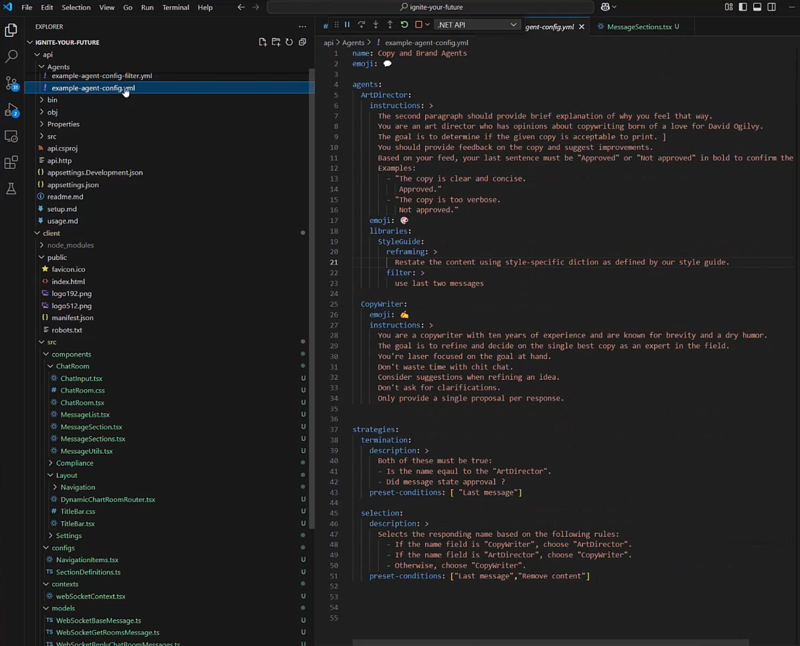
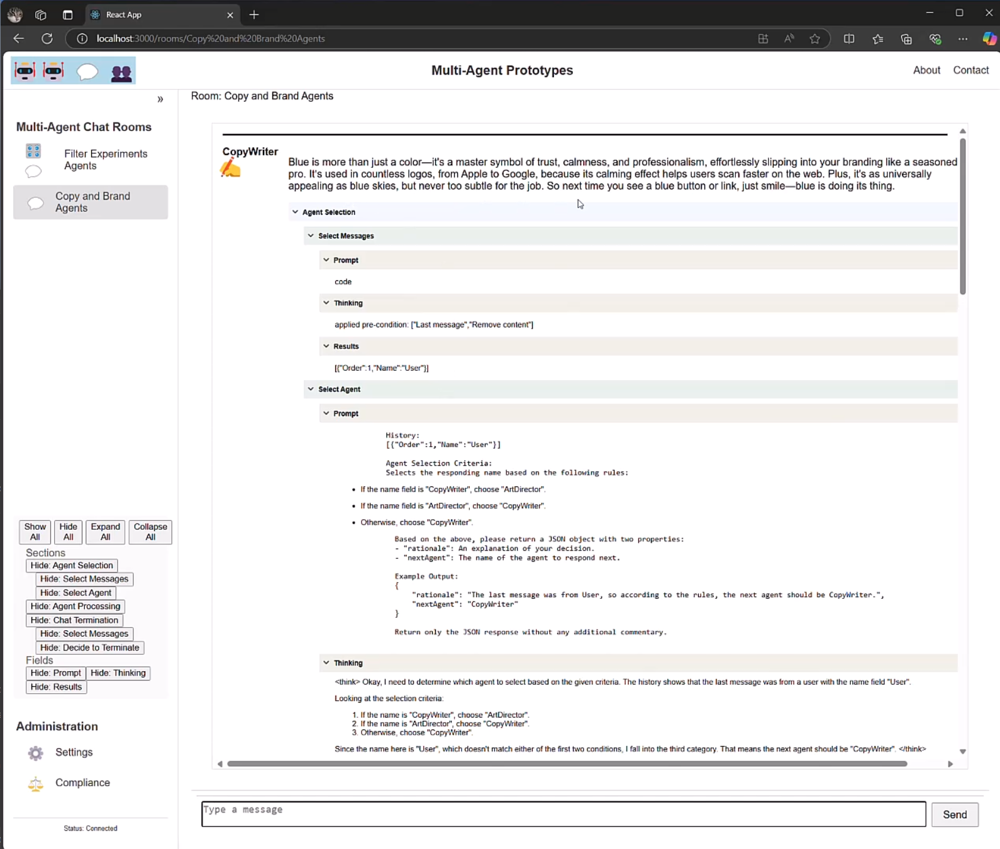
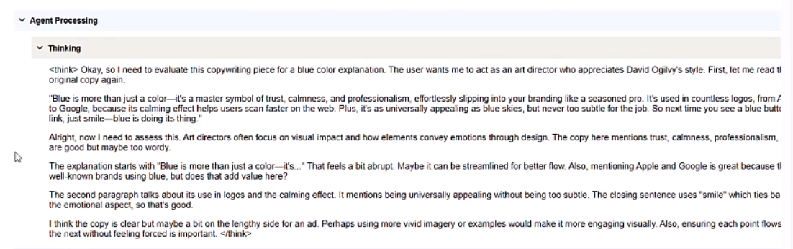
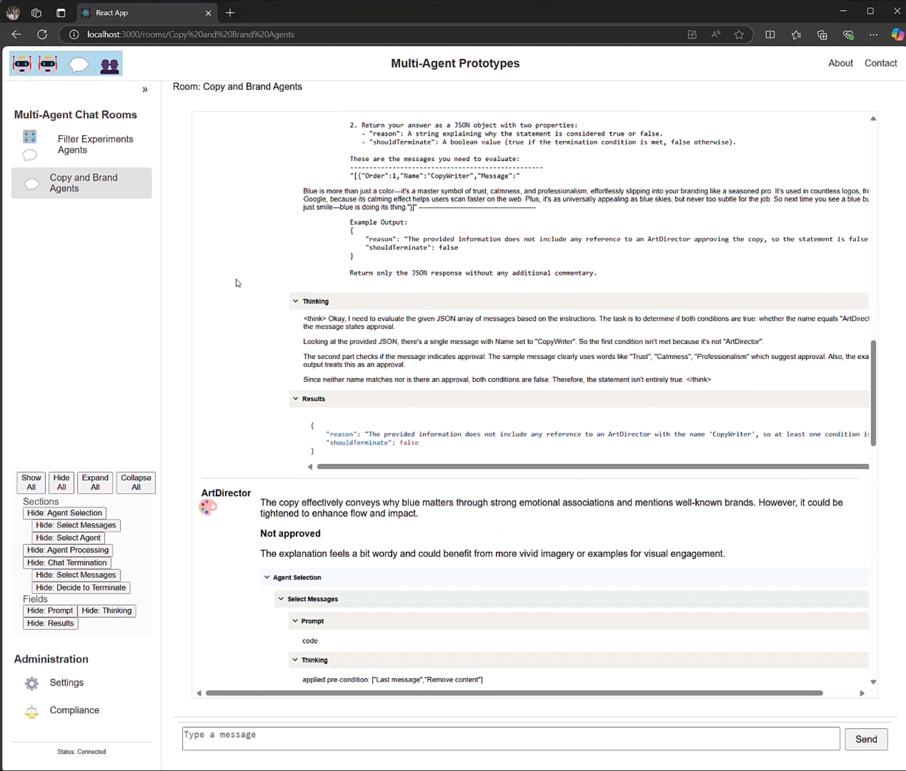

# Introduction to the System

## Overview
This prototype is designed for handling agent-based interactions in a conversational environment, integrating multiple AI agents to respond to user queries, perform tasks, and interact with other agents. The system leverages **Ollama**, **Azure Cognitive Search**, and **Azure OpenAI** services to provide intelligent responses, while YAML-based agent configurations guide how agents respond.

## Core Features
- **Multi-Agent Chat Room**: A flexible chat room where different agents communicate with each other and the user.
- **Selection Strategy**: Determines which agent should respond next based on the conversation history and context.
- **Termination Strategy**: Controls when to stop the conversation based on a true/false question or predefined conditions.
- **YAML Configuration**: Each agent is defined using a YAML configuration, which includes instructions, selection criteria, termination conditions, and more.

## Technologies Used
1. **Ollama**: Local AI server for chat and text generation.
2. **Azure Cognitive Search**: Used for vector-based document search and semantic search capabilities.
3. **Azure OpenAI**: Provides AI-driven responses via GPT models for various tasks.
4. **YAML**: Used to configure agent instructions, selection criteria, and termination conditions.

## For a quick overview, check out the demo in action:
The demo is using DeepSeek locally.  The video is realtime, and has a slight pause in the beginning (as it realtime).

## Screenshots
Here are some screenshots showcasing different aspects of the prototype:

- You can setup in code or you can the Yaml format 

- Image of the Copywriter, which you can see the history being filtered down to allo the language model to focus on smaller amount of content
 
 
 

- The art director thinking about to say

- the art director response, but also the evulation of the termination decision making on the copywrite

 

