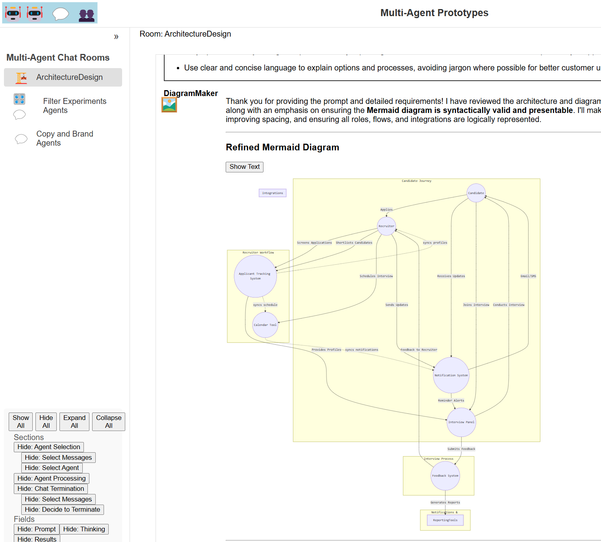

# Introduction to the System

## Overview
This prototype is designed for handling agent-based interactions in a conversational environment, integrating multiple AI agents to respond to user queries, perform tasks, and interact with other agents. The system leverages **Ollama**, **Azure Cognitive Search**, and **Azure OpenAI** services to provide intelligent responses, while YAML-based agent configurations guide how agents respond.

## Core Features
- **Multi-Agent Chat Room**: A flexible chat room where different agents communicate with each other and the user.
- **Selection Strategy**: Determines which agent should respond next based on the conversation history and context.
- **Termination Strategy**: Controls when to stop the conversation based on a true/false question or predefined conditions.
- **YAML Configuration**: Each agent is defined using a YAML configuration, which includes instructions, selection criteria, termination conditions, and more.

## Technologies Used
1. **Ollama**: Local AI server for chat and text generation.
2. **Azure Cognitive Search**: Used for vector-based document search and semantic search capabilities.
3. **Azure OpenAI**: Provides AI-driven responses via GPT models for various tasks.
4. **YAML**: Used to configure agent instructions, selection criteria, and termination conditions.

## Local Run Instructions
For detailed steps on running the system locally, please refer to the respective guides for your operating system:

- **Windows**: [Local Run - winOS.md](./winOS.md)
- **macOS**: [Local Run - macOs.md](./macOs.md)

## For a Quick Overview, Check Out the Demo in Action
The demo uses DeepSeek locally. The video is in realtime and includes a slight pause at the beginning (to accommodate real-time processing).

## Screenshots
Here are some screenshots showcasing different aspects of the prototype:

- **YAML Setup**:  
  You can set up the system in code or use the YAML format.  
  

- **Copywriter Interface**:  
  The Copywriter shows a history being filtered down so that the language model focuses on a smaller amount of content.  
  

- **Art Director Thinking**:  
  An image depicting the Art Director contemplating their next move.  
  

- **Art Director Response**:  
  The Art Director's response along with an evaluation of the termination decision-making on the copy.  
  

- **Diagram with Mermaid**:  
  The system diagram created using Mermaid.  
  

 