 
# Agents and Orchestrators in Multi-Agent Systems

In today’s advanced AI landscape, coordinating multiple specialized units is essential for building scalable, efficient, and robust applications. This white paper introduces two fundamental components—**Agents** and **Orchestrators**—and explains how various orchestration patterns can be applied to real-world tasks. Detailed examples, complete with links, explicit patterns, and sequence diagrams, illustrate each technique.


<h2 id="introduction">1. Introduction</h2>

Modern AI systems often require the collaboration of multiple components working in concert. **Agents** are specialized units that perform dedicated tasks, while **Orchestrators** manage and coordinate these agents to achieve complex objectives. By employing different orchestration patterns, developers can design systems that are both adaptive and robust. This paper explains these concepts and provides practical sample scenarios to guide implementation.

<h2 id="table-of-contents">Table of Contents</h2>

- [What is Semantic Kernel?](#what-is-semantic-kernel)
- [What is an Agent?](#what-is-an-agent)
- [What is an Orchestrator?](#what-is-an-orchestrator)
- [Orchestration Patterns and Visual Representations](#orchestration-patterns-and-visual-representations)
    - [Agent Chat Orchestration](#agent-chat-orchestration)
    - [Parallel Orchestration](#parallel-orchestration)
    - [Collaboration Orchestration](#collaboration-orchestration)
    - [Hierarchical Orchestrator-to-Orchestrator](#hierarchical-orchestrator-to-orchestrator )
- [Samples](#samples)
    - [Sample 1: Reflexion Agent Chat for Iterative Refinement](#sample-1-reflexion-agent-chat-for-iterative-refinement)
    - [Sample 2: DCOP Agent Chat](#sample-2-dcop-agent-chat)
    - [Sample 3: Stigmergic Agent Chat](#sample-3-stigmergic-agent-chat)
    - [Sample 4: Crisis Management Agent Chat – Nuclear Plant Case Study](#sample-4-crisis-management-agent-chat--nuclear-plant-case-study)
    - [Sample 5: Adaptive Collaborative Control Agent Chat](#sample-5-adaptive-collaborative-control-agent-chat)
    - [Sample 6: Technology Meeting Dynamics](#sample-6-technology-meeting-dynamics)
    - [Sample 7: Collaborative Incident Response Chat](#sample-7-collaborative-incident-response-chat)
    - [Sample 8: Collaborative Creative Brainstorming Chat](#sample-8-collaborative-creative-brainstorming-chat)
    - [Sample 9: MARL Agent Chat with Autocurriculum](#sample-9-marl-agent-chat-with-autocurriculum)
    - [Sample 10: Brain-Inspired Agent Chat Patterns](#sample-10-brain-inspired-agent-chat-patterns)
    - [Sample 11: Military Team Agent Chat Patterns](#sample-11-military-team-agent-chat-patterns)
- [Conclusion](#conclusion)
---

<h2 id="what-is-semantic-kernel">2. What is Semantic Kernel?</h2>

[Semantic Kernel](https://github.com/microsoft/semantic-kernel) (SK) is Microsoft’s open-source toolkit that seamlessly integrates large language models into conventional programming environments, simplifying the development of advanced AI applications—especially multi-agent systems. It offers built-in memory components, vector store connectors, and flexible orchestration features that allow you to build robust prototypes and production-ready solutions.


In this project, I am using [Semantic Kernel](https://learn.microsoft.com/en-us/semantic-kernel/) as the core framework to prototype an advanced multi-agent system. Rather than implementing separate specialized agents, Semantic Kernel provides a comprehensive set of built‑in capabilities—including the [ChatCompletion](https://learn.microsoft.com/en-us/semantic-kernel/dotnet/quickstart) component for conversational tasks, the [Memory](https://learn.microsoft.com/en-us/semantic-kernel/memory) module for integrating external data through vector store connectors (such as [Redis](https://redis.io/), [Pinecone](https://www.pinecone.io/), or [Azure Cognitive Search](https://learn.microsoft.com/en-us/azure/search/what-is-azure-search)), and orchestration features that coordinate these capabilities. By leveraging SK Memory for Retrieval-Augmented Generation (RAG) and combining its outputs with those from large language models via [Azure OpenAI Service](https://learn.microsoft.com/en-us/azure/cognitive-services/openai/), the system produces responses that are both contextually rich and factually grounded.

 
For local testing, I am currently using [Ollama](https://ollama.ai/) and [Pinecone](https://www.pinecone.io/) to simulate the environment and manage vector data. When I need to scale the solution, I can easily switch to [Azure services](https://azure.microsoft.com/) or the [OpenAI API](https://openai.com/api), which is one of the great advantages of Semantic Kernel—it supports a variety of models and deployment options, allowing for flexibility across different environments.

For more detailed information, examples, and best practices, please refer to the [Semantic Kernel documentation](https://learn.microsoft.com/en-us/semantic-kernel/).

<h2 id="what-is-an-agent">3. What is an Agent?</h2>

An **Agent** is a self-contained, specialized unit designed to perform a particular task within a larger system. Agents perceive their environment (e.g., via text input) and act upon it (e.g., by generating natural language responses), aligning with the concept of an [intelligent agent](https://en.wikipedia.org/wiki/Intelligent_agent).

<h3 id="example-agents">Example Agents</h3>

- **Chat Agents:**  
  The [ChatCompletionAgent sample](https://github.com/microsoft/semantic-kernel/blob/main/dotnet/samples/GettingStartedWithAgents/README.md) demonstrates how an agent uses a language model to produce conversational responses.

  ```mermaid
  flowchart LR
    UI["User Query"]
    ORCH["Semantic Kernel"]
    CA["Chat Agent - Azure OpenAI Service"]
    LLM["Language Model"]

    UI --> ORCH
    ORCH --> CA
    CA --> ORCH
    ORCH --> UI
    CA --> LLM
    LLM --> CA
    linkStyle 5,4 stroke:#00FF00,stroke-width:2px
  ```

- **Information Gathering Agents:**  
  Semantic Kernel supports plugins for retrieving external data, facilitating Retrieval-Augmented Generation (RAG). See the [Semantic Kernel Vector Store](https://learn.microsoft.com/en-us/semantic-kernel/concepts/vector-store-connectors) for details.

   ```mermaid
  flowchart LR
    UI["User Query"]
    SK["Semantic Kernel"]
    MEM["SK Memory<br> (Vector Store Integration)"]
    VS["Vector Store<br>Redis / Pinecone / Azure Cognitive Search"]
    LLM["Language Model"]

    UI --> SK
    SK --> MEM
    MEM --> VS
    VS --> MEM
    MEM --> SK
    SK --> UI
    MEM --> LLM
    LLM --> MEM
    linkStyle 7,6 stroke:#00FF00,stroke-width:2px
  ```

- **Grounding Agents:**  
  These agents combine language model outputs with external data (e.g., Q&A documents) for well-supported responses. Refer to the [Agent Templates documentation](https://learn.microsoft.com/en-us/semantic-kernel/frameworks/agent/agent-templates) for more.

  ```mermaid
  flowchart LR
    UI["User Query"]
    SK["Semantic Kernel"]
    MEM["SK Memory<br> (Vector Store Integration)"]
    KB["Document Repository<br>Azure Blob Storage / Cognitive Search"]
    LLM["Language Model"]

    UI --> SK
    SK --> MEM
    MEM --> KB
    KB --> MEM
    MEM --> SK
    SK --> UI
    MEM --> LLM
    LLM --> MEM
    linkStyle 7,6 stroke:#00FF00,stroke-width:2px
  ```

- **System Integration Agents:**  
  Agents can simulate integrations such as checking a car’s battery level or initiating a charging process.

  ```mermaid
  flowchart LR
    UI["User Query:<br> Check Car Battery"]
    SK["Semantic Kernel"]
    SIM["System Integration Module"]
    IOT["Azure IoT Hub/Logic Apps<br>External Car Battery API"]
    LLM["Language Model"]

    UI --> SK
    SK --> SIM
    SIM --> IOT
    IOT --> SIM
    SIM --> SK
    SIM --> LLM
    LLM --> SIM
    SK --> UI
    linkStyle 6,5 stroke:#00FF00,stroke-width:2px
  ```

  More examples can be found in the [Getting Started With Agents repository](https://github.com/microsoft/semantic-kernel/blob/main/dotnet/samples/GettingStartedWithAgents/README.md).

<h2 id="what-is-an-orchestrator">4. What is an Orchestrator?</h2>

An **Orchestrator** is a central controller that coordinates interactions among multiple agents—or even subordinate orchestrators—to complete complex tasks. Its responsibilities include:

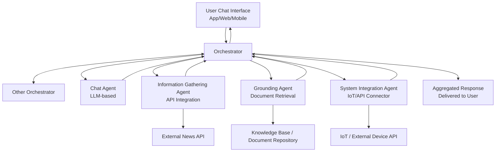
```mermaid
flowchart TD
    UI["User Chat Interface<br/>App/Web/Mobile"]
    ORCH1["Orchestrator"]
    ORCH2["Other Orchestrator"]

    CA["Chat Agent<br/>LLM-based"]
    IGA["Information Gathering Agent<br/>API Integration"]
    GA["Grounding Agent<br/>Document Retrieval"]
    SIA["System Integration Agent<br/>IoT/API Connector"]

    API1["External News API"]
    KB["Knowledge Base / Document Repository"]
    IOT["IoT / External Device API"]

    UI --> ORCH1
    ORCH1 --> UI
    ORCH1 --> CA
    ORCH1 --> IGA
    ORCH1 --> GA
    ORCH1 --> SIA

    IGA --> API1
    GA --> KB
    SIA --> IOT

    CA --> ORCH1
    IGA --> ORCH1
    GA --> ORCH1
    SIA --> ORCH1

    ORCH1 <--> ORCH2

    ORCH1 --> RES["Aggregated Response<br/>Delivered to User"]
```

### Some Common Activities:
- **Managing Agent Selection:** Deciding which agent should respond next based on rules or strategies.
- **Maintaining Coherent Communication:** Ensuring that the overall dialogue or process flow remains structured.
- **Implementing Termination and Refinement:** Determining when the process should end or when outputs need to be consolidated.

This approach is inspired by foundational texts such as [Artificial Intelligence: A Modern Approach](http://aima.cs.berkeley.edu/) and aligns with principles found in the [intelligent agent](https://en.wikipedia.org/wiki/Intelligent_agent) literature.

<h2 id="orchestration-patterns-and-visual-representations">5. Orchestration Patterns and Visual Representations</h2>

Multi-agent systems can leverage several orchestration patterns to meet different application needs. Below are the four primary orchestration patterns, each explained and accompanied by its original sequence diagram.

<h3 id="agent-chat-orchestration">Agent Chat Orchestration (Sequential Flow)</h3>
A central orchestrator sequentially invokes agents, ensuring that each agent’s contribution is evaluated before the next is called. This approach is ideal for tasks requiring iterative refinement, where each step builds on the previous output.

**Original Diagram:**
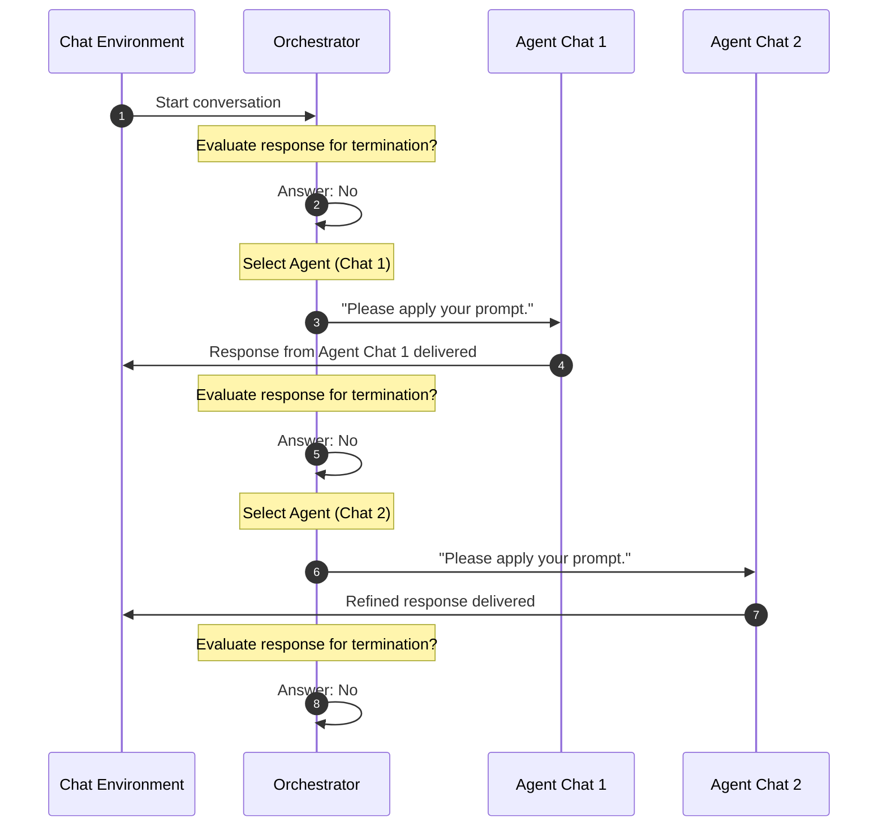
```mermaid
sequenceDiagram
    autonumber
    participant ChatEnv as Chat Environment
    participant OS as Orchestrator
    participant A1 as Agent Chat 1
    participant A2 as Agent Chat 2
    ChatEnv->>OS: Start conversation
    Note over OS: Evaluate response for termination?
    OS->>OS: Answer: No 
    Note over OS: Select Agent (Chat 1)
    OS->>A1: "Please apply your prompt."
    A1->>ChatEnv: Response from Agent Chat 1 delivered
    Note over OS: Evaluate response for termination?
    OS->>OS: Answer: No
    Note over OS: Select Agent (Chat 2)
    OS->>A2: "Please apply your prompt."
    A2->>ChatEnv: Refined response delivered
    Note over OS: Evaluate response for termination?
    OS->>OS: Answer: No 
```

<h3 id="parallel-orchestration">Parallel Orchestration</h3>
Multiple agents are activated concurrently, and their responses are later aggregated by the orchestrator. This pattern reduces latency and benefits applications that require rapid processing and redundancy.

**Original Diagram:**
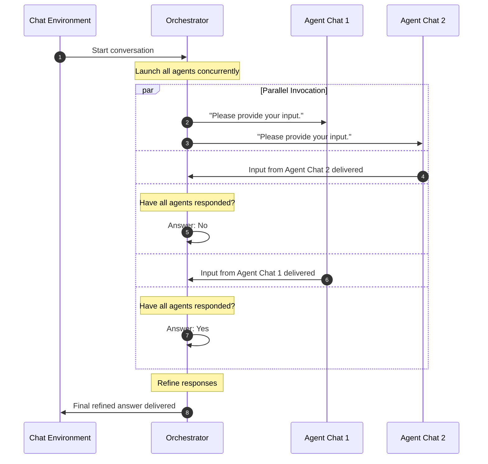
```mermaid
sequenceDiagram
    autonumber
    participant ChatEnv as Chat Environment
    participant OS as Orchestrator
    participant A1 as Agent Chat 1
    participant A2 as Agent Chat 2
    ChatEnv->>OS: Start conversation
    Note over OS: Launch all agents concurrently
    par Parallel Invocation
        OS->>A1: "Please provide your input."
        OS->>A2: "Please provide your input."
    and
        A2->>OS: Input from Agent Chat 2 delivered
    and
        Note over OS: Have all agents responded?
        OS->>OS: Answer: No 
    and
        A1->>OS: Input from Agent Chat 1 delivered
    and
        Note over OS: Have all agents responded?
        OS->>OS: Answer: Yes 
    end
    Note over OS: Refine responses
    OS->>ChatEnv: Final refined answer delivered
```

<h3 id="collaboration-orchestration">Collaboration Orchestration</h3>
In this model, a primary orchestrator drives the main process while a secondary orchestrator monitors the context and provides asynchronous feedback. This approach integrates structured responses with creative or corrective insights, making it particularly useful in environments where both planned input and adaptive suggestions are necessary.

**Original Diagram:**
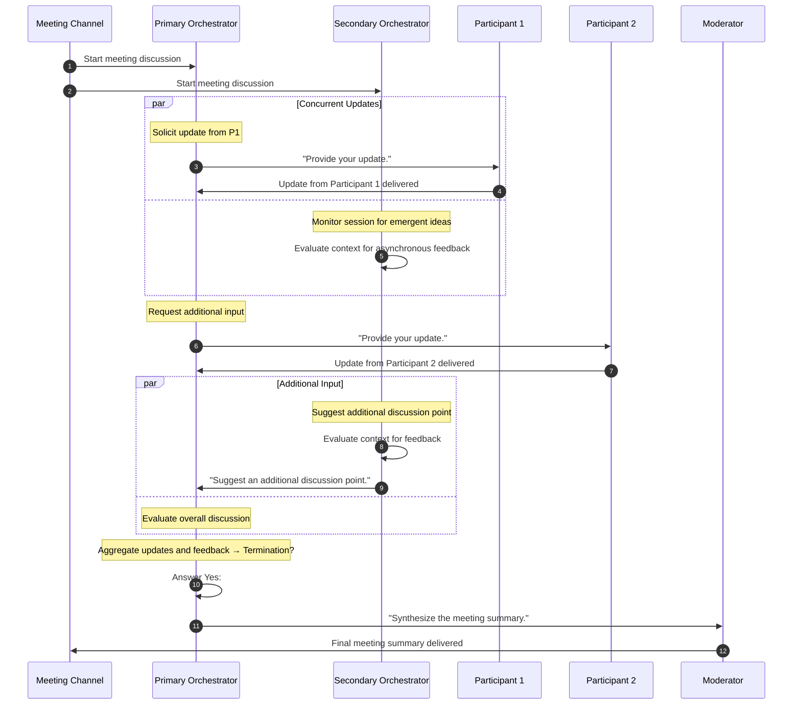
```mermaid
sequenceDiagram
    autonumber
    participant ChatEnv as Meeting Channel
    participant PO as Primary Orchestrator
    participant SO as Secondary Orchestrator
    participant P1 as Participant 1
    participant P2 as Participant 2
    participant Mod as Moderator
    ChatEnv->>PO: Start meeting discussion
    ChatEnv->>SO: Start meeting discussion
    par Concurrent Updates
        Note over PO: Solicit update from P1
        PO->>P1: "Provide your update."
        P1->>PO: Update from Participant 1 delivered
    and
        Note over SO: Monitor session for emergent ideas
        SO->>SO: Evaluate context for asynchronous feedback
    end
    Note over PO: Request additional input
    PO->>P2: "Provide your update."
    P2->>PO: Update from Participant 2 delivered
    par Additional Input
        Note over SO: Suggest additional discussion point
        SO->>SO: Evaluate context for feedback
        SO->>PO: "Suggest an additional discussion point."
    and
        Note over PO: Evaluate overall discussion
    end
    Note over PO: Aggregate updates and feedback → Termination?
    PO->>PO: Answer Yes:
    PO->>Mod: "Synthesize the meeting summary."
    Mod->>ChatEnv: Final meeting summary delivered
```

<h3 id="hierarchical-orchestrator-to-orchestrator">Hierarchical Orchestrator-to-Orchestrator</h3>
A primary orchestrator delegates tasks to subordinate orchestrators, each managing groups of specialized agents. Their aggregated outputs are synthesized into a final, comprehensive outcome. This layered structure is beneficial for handling complex, multi-level tasks that require scalable decision-making.

**Original Diagram:**
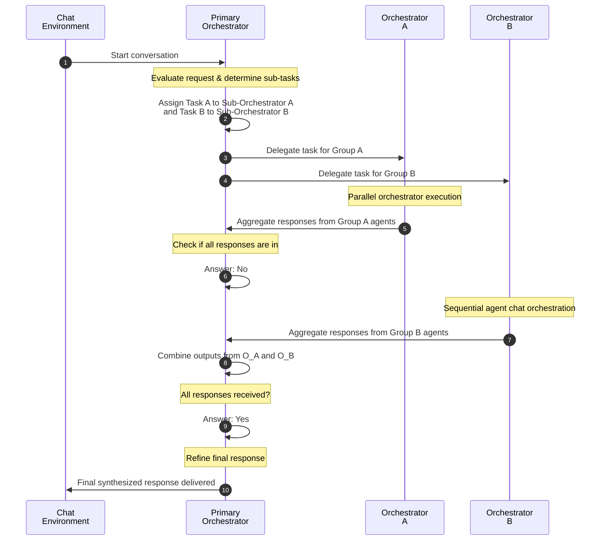
```mermaid
sequenceDiagram
    autonumber
    participant ChatEnv as Chat<br>Environment
    participant PO as Primary<br>Orchestrator
    participant O_A as Orchestrator<br>A
    participant O_B as Orchestrator<br>B
    ChatEnv->>PO: Start conversation
    Note over PO: Evaluate request & determine sub-tasks
    PO->>PO: Assign Task A to Sub-Orchestrator A<br> and Task B to Sub-Orchestrator B
    PO->>O_A: Delegate task for Group A
    PO->>O_B: Delegate task for Group B

    Note over O_A: Parallel orchestrator execution
    O_A->>PO: Aggregate responses from Group A agents
    Note over PO: Check if all responses are in
    PO->>PO: Answer: No 
    Note over O_B: Sequential agent chat orchestration  
    O_B->>PO: Aggregate responses from Group B agents 
    PO->>PO: Combine outputs from O_A and O_B
    Note over PO: All responses received?
    PO->>PO: Answer: Yes 
    Note over PO: Refine final response
    PO->>ChatEnv: Final synthesized response delivered
```

---

<h2 id="detailed-sample-scenarios">6. Detailed Sample Scenarios</h2>

<h3 id="sample-1-reflexion-agent-chat-for-iterative-refinement">Sample 1: Reflexion Agent Chat for Iterative Refinement</h3>

This sample demonstrates a process where an agent provides an initial answer, a peer critic reviews it, and then the agent refines its answer based on feedback. This iterative self-reflection mimics human critical thinking and is ideal for complex or ambiguous queries.

**Links:**  
[Reflexion on GitHub](https://github.com/dair-ai/reflexion) | [Chain-of-Thought Prompting](https://ai.googleblog.com/2022/05/chain-of-thought-prompting-enhances.html)

**Pattern:** Agent Chat Orchestration (Sequential Flow)

**Original Diagram:**
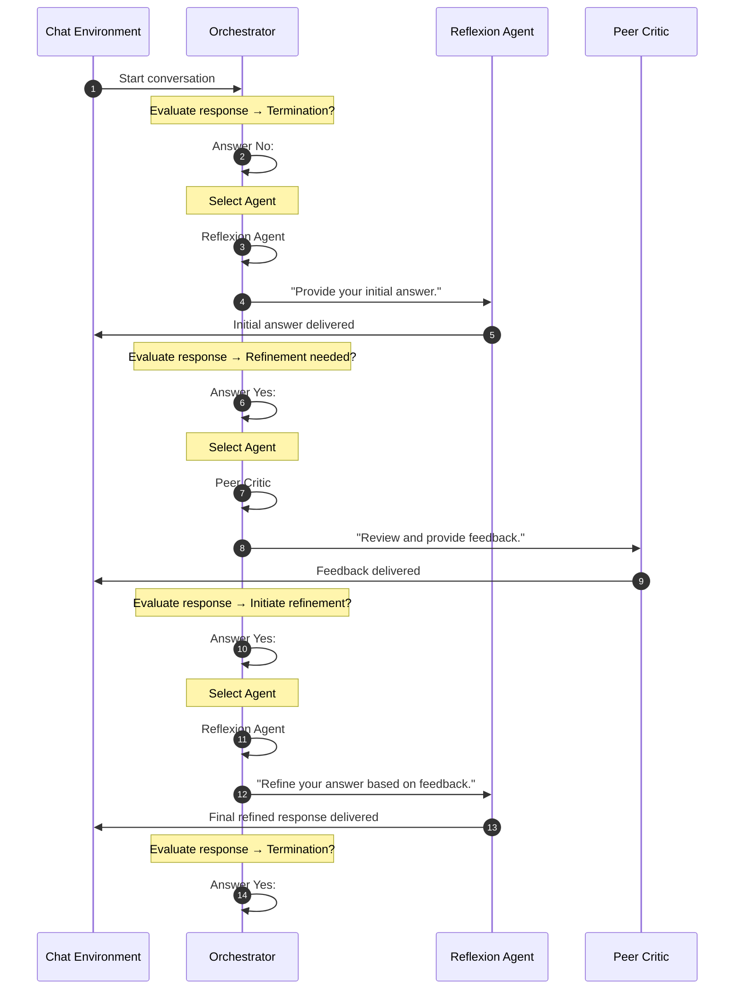
```mermaid
sequenceDiagram
    autonumber
    participant ChatEnv as Chat Environment
    participant OS as Orchestrator
    participant RA as Reflexion Agent
    participant Crit as Peer Critic
    ChatEnv->>OS: Start conversation
    Note over OS: Evaluate response → Termination?
    OS->>OS: Answer No:
    Note over OS: Select Agent
    OS->>OS: Reflexion Agent
    OS->>RA: "Provide your initial answer."
    RA->>ChatEnv: Initial answer delivered
    Note over OS: Evaluate response → Refinement needed?
    OS->>OS: Answer Yes:
    Note over OS: Select Agent
    OS->>OS: Peer Critic
    OS->>Crit: "Review and provide feedback."
    Crit->>ChatEnv: Feedback delivered
    Note over OS: Evaluate response → Initiate refinement?
    OS->>OS: Answer Yes:
    Note over OS: Select Agent
    OS->>OS: Reflexion Agent
    OS->>RA: "Refine your answer based on feedback."
    RA->>ChatEnv: Final refined response delivered
    Note over OS: Evaluate response → Termination?
    OS->>OS: Answer Yes:
```

<h3 id="sample-2-dcop-agent-chat">Sample 2: DCOP Agent Chat</h3>

Inspired by distributed constraint optimization, this sample sequentially calls agents to propose a solution, evaluate its cost based on constraints, and then refine the solution. It is particularly useful in optimization tasks naturally divided into sub-problems, ensuring that every component of the solution is carefully evaluated and improved.

**Links:**  
[Distributed Constraint Optimization](https://en.wikipedia.org/wiki/Distributed_constraint_optimization)

**Pattern:** Agent Chat Orchestration (Sequential Flow)

**Original Diagram:**
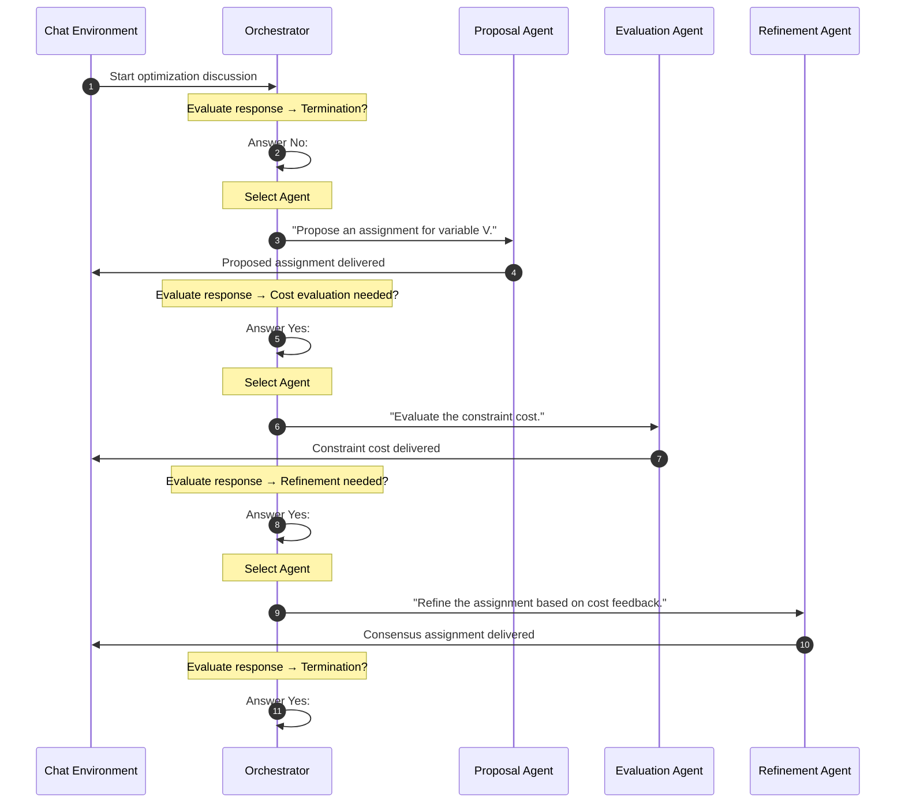
```mermaid
sequenceDiagram
    autonumber
    participant ChatEnv as Chat Environment
    participant OS as Orchestrator
    participant DCOP1 as Proposal Agent
    participant DCOP2 as Evaluation Agent
    participant DCOP3 as Refinement Agent
    ChatEnv->>OS: Start optimization discussion
    Note over OS: Evaluate response → Termination?
    OS->>OS: Answer No:
    Note over OS: Select Agent
    OS->>DCOP1: "Propose an assignment for variable V."
    DCOP1->>ChatEnv: Proposed assignment delivered
    Note over OS: Evaluate response → Cost evaluation needed?
    OS->>OS: Answer Yes:
    Note over OS: Select Agent
    OS->>DCOP2: "Evaluate the constraint cost."
    DCOP2->>ChatEnv: Constraint cost delivered
    Note over OS: Evaluate response → Refinement needed?
    OS->>OS: Answer Yes:
    Note over OS: Select Agent
    OS->>DCOP3: "Refine the assignment based on cost feedback."
    DCOP3->>ChatEnv: Consensus assignment delivered
    Note over OS: Evaluate response → Termination?
    OS->>OS: Answer Yes:
```

<h3 id="sample-3-stigmergic-agent-chat">Sample 3: Stigmergic Agent Chat</h3>

In this sample, two agents concurrently post cues that are later aggregated. Inspired by the concept of stigmergy, this approach leverages the collective intelligence of agents working in parallel—ideal for scenarios requiring rapid, concurrent contributions to form a unified output.

**Links:**  
[Stigmergy on Wikipedia](https://en.wikipedia.org/wiki/Stigmergy)

**Pattern:** Parallel Orchestration

**Original Diagram:**
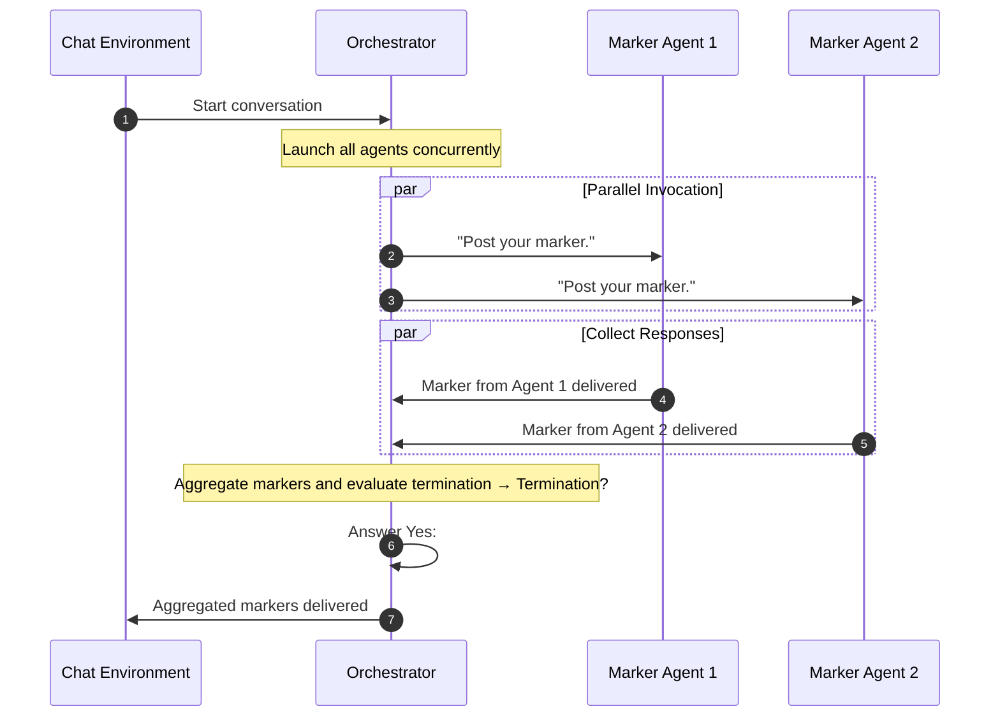
```mermaid
sequenceDiagram
    autonumber
    participant ChatEnv as Chat Environment
    participant OS as Orchestrator
    participant SA1 as Marker Agent 1
    participant SA2 as Marker Agent 2
    ChatEnv->>OS: Start conversation
    Note over OS: Launch all agents concurrently
    par Parallel Invocation
        OS->>SA1: "Post your marker."
        OS->>SA2: "Post your marker."
    end
    par Collect Responses
        SA1->>OS: Marker from Agent 1 delivered
        SA2->>OS: Marker from Agent 2 delivered
    end
    Note over OS: Aggregate markers and evaluate termination → Termination?
    OS->>OS: Answer Yes:
    OS->>ChatEnv: Aggregated markers delivered
```

<h3 id="sample-4-crisis-management-agent-chat-nuclear-plant-case-study">Sample 4: Crisis Management Agent Chat – Nuclear Plant Case Study</h3>

Two crisis agents simultaneously report critical parameters like reactor status and containment conditions. Their combined inputs provide redundant, vital information for a crisis manager to make rapid decisions—crucial in high-stakes scenarios where timely, accurate data is essential.

**Links:**  
[Crisis Management on Wikipedia](https://en.wikipedia.org/wiki/Crisis_management)

**Pattern:** Parallel Orchestration

**Original Diagram:**
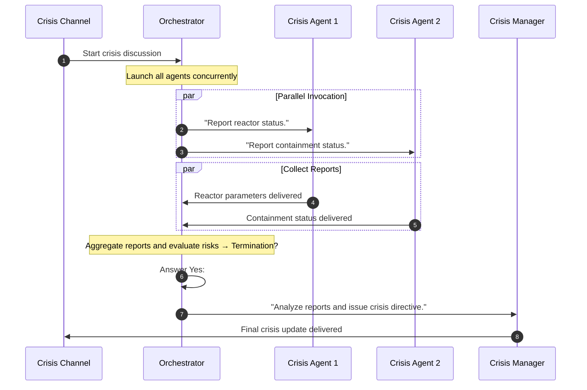
```mermaid
sequenceDiagram
    autonumber
    participant ChatEnv as Crisis Channel
    participant OS as Orchestrator
    participant CM1 as Crisis Agent 1
    participant CM2 as Crisis Agent 2
    participant Lead as Crisis Manager
    ChatEnv->>OS: Start crisis discussion
    Note over OS: Launch all agents concurrently
    par Parallel Invocation
        OS->>CM1: "Report reactor status."
        OS->>CM2: "Report containment status."
    end
    par Collect Reports
        CM1->>OS: Reactor parameters delivered
        CM2->>OS: Containment status delivered
    end
    Note over OS: Aggregate reports and evaluate risks → Termination?
    OS->>OS: Answer Yes:
    OS->>Lead: "Analyze reports and issue crisis directive."
    Lead->>ChatEnv: Final crisis update delivered
```

<h3 id="sample-5-adaptive-collaborative-control-agent-chat">Sample 5: Adaptive Collaborative Control Agent Chat</h3>

A primary orchestrator gathers routine status updates while a secondary orchestrator monitors for anomalies and suggests corrective actions. This dual-layer approach is particularly effective in industrial control systems, where continuous monitoring and real-time adjustments are critical.

**Links:**  
[Distributed Control Systems on Wikipedia](https://en.wikipedia.org/wiki/Distributed_control_system)

**Pattern:** Collaboration Orchestration

**Original Diagram:**
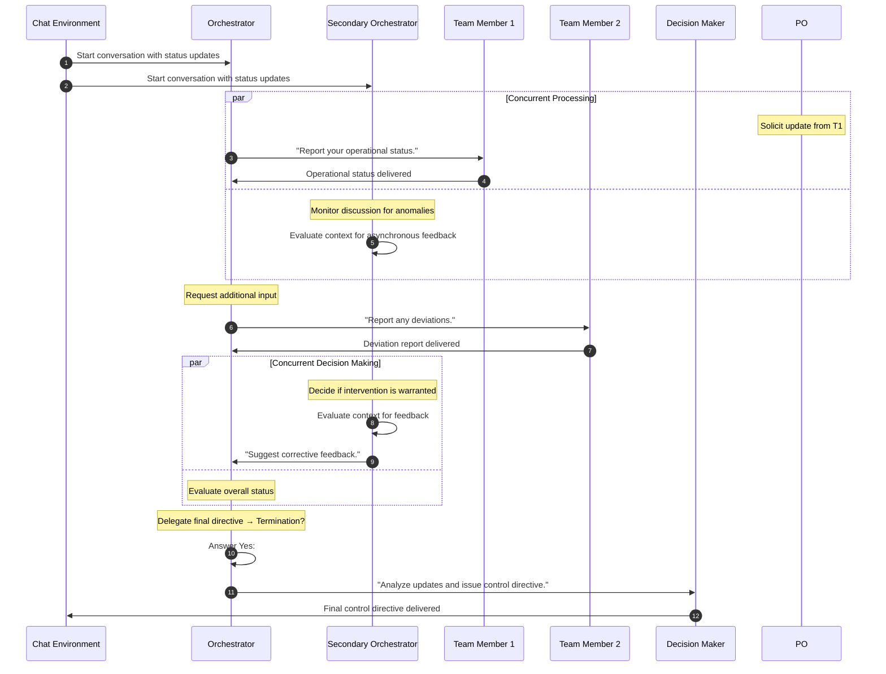
```mermaid
sequenceDiagram
    autonumber
    participant ChatEnv as Chat Environment
    participant OS as Orchestrator
    participant SO as Secondary Orchestrator
    participant T1 as Team Member 1
    participant T2 as Team Member 2
    participant Lead as Decision Maker
    ChatEnv->>OS: Start conversation with status updates
    ChatEnv->>SO: Start conversation with status updates
    par Concurrent Processing
        Note over PO: Solicit update from T1
        OS->>T1: "Report your operational status."
        T1->>OS: Operational status delivered
    and
        Note over SO: Monitor discussion for anomalies
        SO->>SO: Evaluate context for asynchronous feedback
    end
    Note over OS: Request additional input
    OS->>T2: "Report any deviations."
    T2->>OS: Deviation report delivered
    par Concurrent Decision Making
        Note over SO: Decide if intervention is warranted
        SO->>SO: Evaluate context for feedback
        SO->>OS: "Suggest corrective feedback."
    and
        Note over OS: Evaluate overall status
    end
    Note over OS: Delegate final directive → Termination?
    OS->>OS: Answer Yes:
    OS->>Lead: "Analyze updates and issue control directive."
    Lead->>ChatEnv: Final control directive delivered
```

<h3 id="sample-6-technology-meeting-dynamics">Sample 6: Technology Meeting Dynamics</h3>

A meeting environment is captured where structured updates are combined with spontaneous ideas. The primary orchestrator collects participant updates while a secondary orchestrator monitors for emergent insights, ensuring the final meeting summary reflects both planned content and creative contributions.

**Links:**  
[Observer Pattern on Wikipedia](https://en.wikipedia.org/wiki/Observer_pattern)

**Pattern:** Collaboration Orchestration

**Original Diagram:**
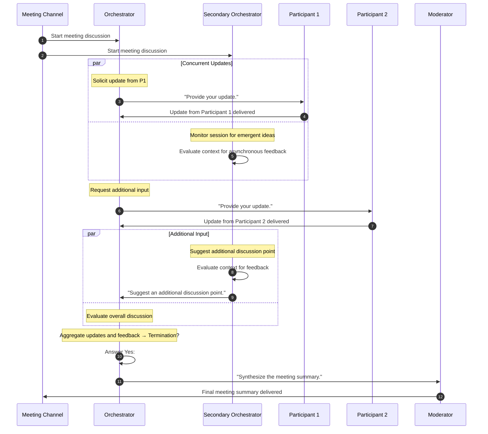
```mermaid
sequenceDiagram
    autonumber
    participant ChatEnv as Meeting Channel
    participant OS as Orchestrator
    participant SO as Secondary Orchestrator
    participant P1 as Participant 1
    participant P2 as Participant 2
    participant Mod as Moderator
    ChatEnv->>OS: Start meeting discussion
    ChatEnv->>SO: Start meeting discussion
    par Concurrent Updates
        Note over OS: Solicit update from P1
        OS->>P1: "Provide your update."
        P1->>OS: Update from Participant 1 delivered
    and
        Note over SO: Monitor session for emergent ideas
        SO->>SO: Evaluate context for asynchronous feedback
    end
    Note over OS: Request additional input
    OS->>P2: "Provide your update."
    P2->>OS: Update from Participant 2 delivered
    par Additional Input
        Note over SO: Suggest additional discussion point
        SO->>SO: Evaluate context for feedback
        SO->>OS: "Suggest an additional discussion point."
    and
        Note over OS: Evaluate overall discussion
    end
    Note over OS: Aggregate updates and feedback → Termination?
    OS->>OS: Answer Yes:
    OS->>Mod: "Synthesize the meeting summary."
    Mod->>ChatEnv: Final meeting summary delivered
```

<h3 id="sample-7-collaborative-incident-response-chat">Sample 7: Collaborative Incident Response Chat</h3>

For rapid situational awareness in incident management, a primary orchestrator collects real-time updates from field agents while a secondary orchestrator monitors for anomalies and recommends further investigation. The combined information yields a comprehensive incident report critical for timely crisis resolution.

**Links:**  
[Incident Management on Wikipedia](https://en.wikipedia.org/wiki/Incident_management)

**Pattern:** Collaboration Orchestration

**Original Diagram:**
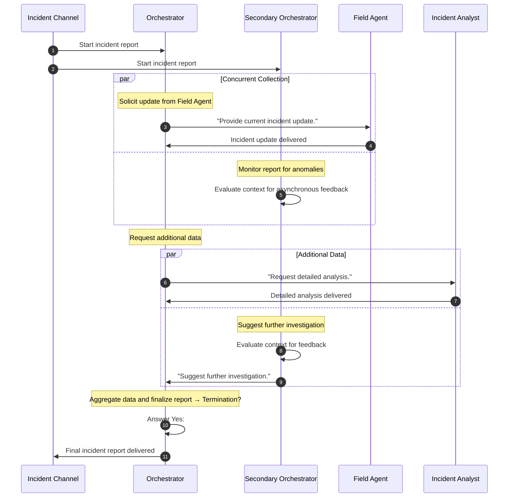
```mermaid
sequenceDiagram
    autonumber
    participant ChatEnv as Incident Channel
    participant OS as Orchestrator
    participant SO as Secondary Orchestrator
    participant Field as Field Agent
    participant Analyst as Incident Analyst
    ChatEnv->>OS: Start incident report
    ChatEnv->>SO: Start incident report
    par Concurrent Collection
        Note over OS: Solicit update from Field Agent
        OS->>Field: "Provide current incident update."
        Field->>OS: Incident update delivered
    and
        Note over SO: Monitor report for anomalies
        SO->>SO: Evaluate context for asynchronous feedback
    end
    Note over OS: Request additional data
    par Additional Data
        OS->>Analyst: "Request detailed analysis."
        Analyst->>OS: Detailed analysis delivered
    and
        Note over SO: Suggest further investigation
        SO->>SO: Evaluate context for feedback
        SO->>OS: "Suggest further investigation."
    end
    Note over OS: Aggregate data and finalize report → Termination?
    OS->>OS: Answer Yes:
    OS->>ChatEnv: Final incident report delivered
```

<h3 id="sample-8-collaborative-creative-brainstorming-chat">Sample 8: Collaborative Creative Brainstorming Chat</h3>

In a creative brainstorming session, ideas from various participants are gathered and breakthrough suggestions highlighted. This process captures both routine and innovative contributions, providing a powerful tool for collaborative ideation and problem solving.

**Links:**  
[Brainstorming on Wikipedia](https://en.wikipedia.org/wiki/Brainstorming)

**Pattern:** Collaboration Orchestration

**Original Diagram:**
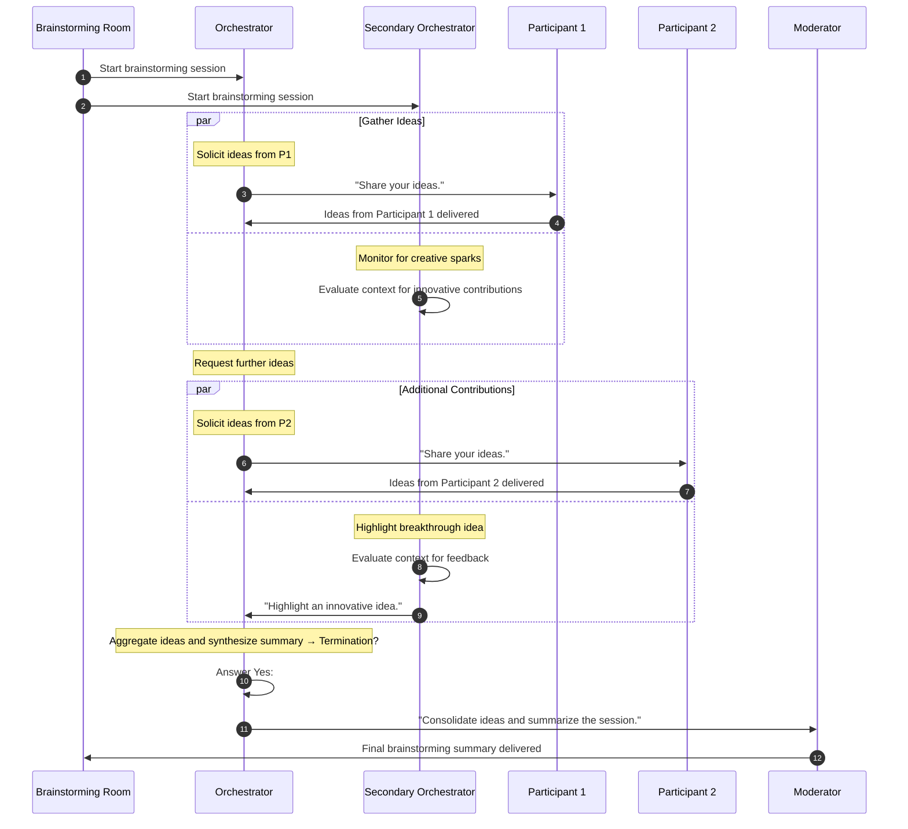
```mermaid
sequenceDiagram
    autonumber
    participant ChatEnv as Brainstorming Room
    participant OS as Orchestrator
    participant SO as Secondary Orchestrator
    participant P1 as Participant 1
    participant P2 as Participant 2
    participant Mod as Moderator
    ChatEnv->>OS: Start brainstorming session
    ChatEnv->>SO: Start brainstorming session
    par Gather Ideas
        Note over OS: Solicit ideas from P1
        OS->>P1: "Share your ideas."
        P1->>OS: Ideas from Participant 1 delivered
    and
        Note over SO: Monitor for creative sparks
        SO->>SO: Evaluate context for innovative contributions
    end
    Note over OS: Request further ideas
    par Additional Contributions
        Note over OS: Solicit ideas from P2
        OS->>P2: "Share your ideas."
        P2->>OS: Ideas from Participant 2 delivered
    and
        Note over SO: Highlight breakthrough idea
        SO->>SO: Evaluate context for feedback
        SO->>OS: "Highlight an innovative idea."
    end
    Note over OS: Aggregate ideas and synthesize summary → Termination?
    OS->>OS: Answer Yes:
    OS->>Mod: "Consolidate ideas and summarize the session."
    Mod->>ChatEnv: Final brainstorming summary delivered
```

<h3 id="sample-9-marl-agent-chat-with-autocurriculum">Sample 9: MARL Agent Chat with Autocurriculum</h3>

Inspired by multi-agent reinforcement learning, this sample shows a primary orchestrator delegating strategy proposals to two subordinate orchestrators concurrently. The aggregated outputs are refined into a final strategy, making this approach ideal for complex environments where iterative learning from diverse perspectives is essential.

**Links:**  
[Multi-Agent Reinforcement Learning on Wikipedia](https://en.wikipedia.org/wiki/Multi-agent_reinforcement_learning) | [Autocurriculum Research](https://arxiv.org/abs/1911.08265)

**Pattern:** Hierarchical Orchestrator-to-Orchestrator

**Original Diagram:**
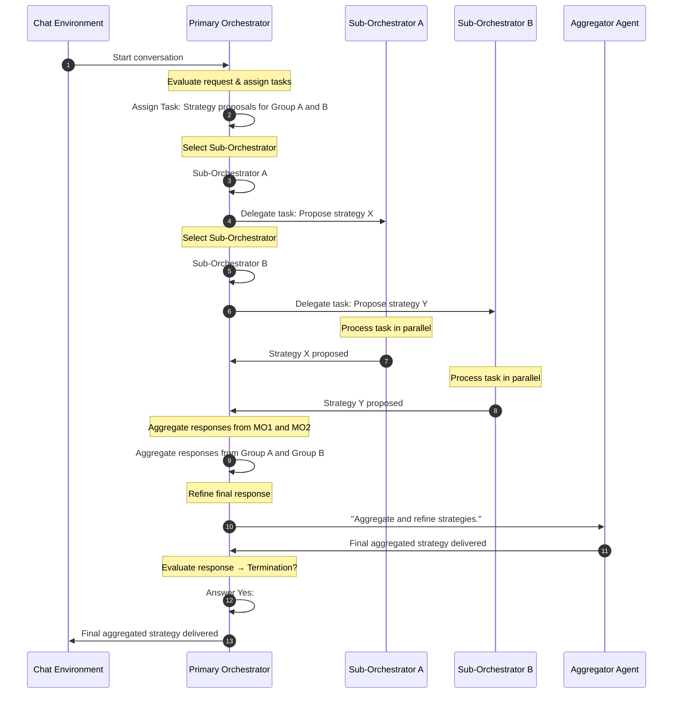
```mermaid
sequenceDiagram
    autonumber
    participant ChatEnv as Chat Environment
    participant PO as Primary Orchestrator
    participant MO1 as Sub-Orchestrator A
    participant MO2 as Sub-Orchestrator B
    participant Agg as Aggregator Agent
    ChatEnv->>PO: Start conversation
    Note over PO: Evaluate request & assign tasks
    PO->>PO: Assign Task: Strategy proposals for Group A and B
    Note over PO: Select Sub-Orchestrator
    PO->>PO: Sub-Orchestrator A
    PO->>MO1: Delegate task: Propose strategy X
    Note over PO: Select Sub-Orchestrator
    PO->>PO: Sub-Orchestrator B
    PO->>MO2: Delegate task: Propose strategy Y
    Note over MO1: Process task in parallel
    MO1->>PO: Strategy X proposed
    Note over MO2: Process task in parallel
    MO2->>PO: Strategy Y proposed
    Note over PO: Aggregate responses from MO1 and MO2
    PO->>PO: Aggregate responses from Group A and Group B
    Note over PO: Refine final response
    PO->>Agg: "Aggregate and refine strategies."
    Agg->>PO: Final aggregated strategy delivered
    Note over PO: Evaluate response → Termination?
    PO->>PO: Answer Yes:
    PO->>ChatEnv: Final aggregated strategy delivered
```

<h3 id="sample-10-brain-inspired-agent-chat-patterns">Sample 10: Brain-Inspired Agent Chat Patterns</h3>

This sample adopts a layered, brain-inspired approach where a primary orchestrator assigns low-level processing tasks to one subordinate orchestrator and mid-level aggregation tasks to another. The combined outputs are then forwarded to a high-level agent for strategic interpretation. This method mirrors hierarchical processing in the human brain, making it ideal for complex reasoning and data synthesis tasks that require multiple levels of abstraction.

**Links:**  
[Neuromorphic Engineering on Wikipedia](https://en.wikipedia.org/wiki/Neuromorphic_engineering)

**Pattern:** Hierarchical Orchestrator-to-Orchestrator

**Original Diagram:**
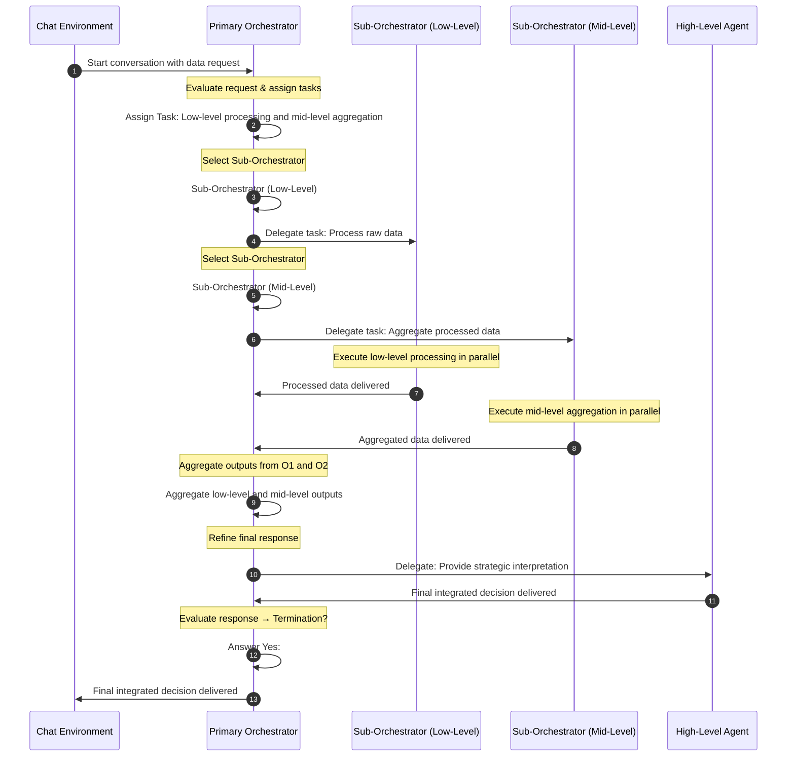
```mermaid
sequenceDiagram
    autonumber
    participant ChatEnv as Chat Environment
    participant PO as Primary Orchestrator
    participant O1 as Sub-Orchestrator (Low-Level)
    participant O2 as Sub-Orchestrator (Mid-Level)
    participant High as High-Level Agent
    ChatEnv->>PO: Start conversation with data request
    Note over PO: Evaluate request & assign tasks
    PO->>PO: Assign Task: Low-level processing and mid-level aggregation
    Note over PO: Select Sub-Orchestrator
    PO->>PO: Sub-Orchestrator (Low-Level)
    PO->>O1: Delegate task: Process raw data
    Note over PO: Select Sub-Orchestrator
    PO->>PO: Sub-Orchestrator (Mid-Level)
    PO->>O2: Delegate task: Aggregate processed data
    Note over O1: Execute low-level processing in parallel
    O1->>PO: Processed data delivered
    Note over O2: Execute mid-level aggregation in parallel
    O2->>PO: Aggregated data delivered
    Note over PO: Aggregate outputs from O1 and O2
    PO->>PO: Aggregate low-level and mid-level outputs
    Note over PO: Refine final response
    PO->>High: Delegate: Provide strategic interpretation
    High->>PO: Final integrated decision delivered
    Note over PO: Evaluate response → Termination?
    PO->>PO: Answer Yes:
    PO->>ChatEnv: Final integrated decision delivered
```

<h3 id="sample-11-military-team-agent-chat-patterns">Sample 11: Military Team Agent Chat Patterns</h3>

Emulating a military chain-of-command, this sample shows a primary orchestrator collecting tactical updates from individual field units while a subordinate commander orchestrator aggregates these inputs. The final mission directive is issued based on the combined intelligence—a technique crucial in high-pressure environments where clear hierarchical decision-making and coordinated communication are essential.

**Links:**  
[Chain of Command on Wikipedia](https://en.wikipedia.org/wiki/Chain_of_command)

**Pattern:** Hierarchical Orchestrator-to-Orchestrator

**Original Diagram:**
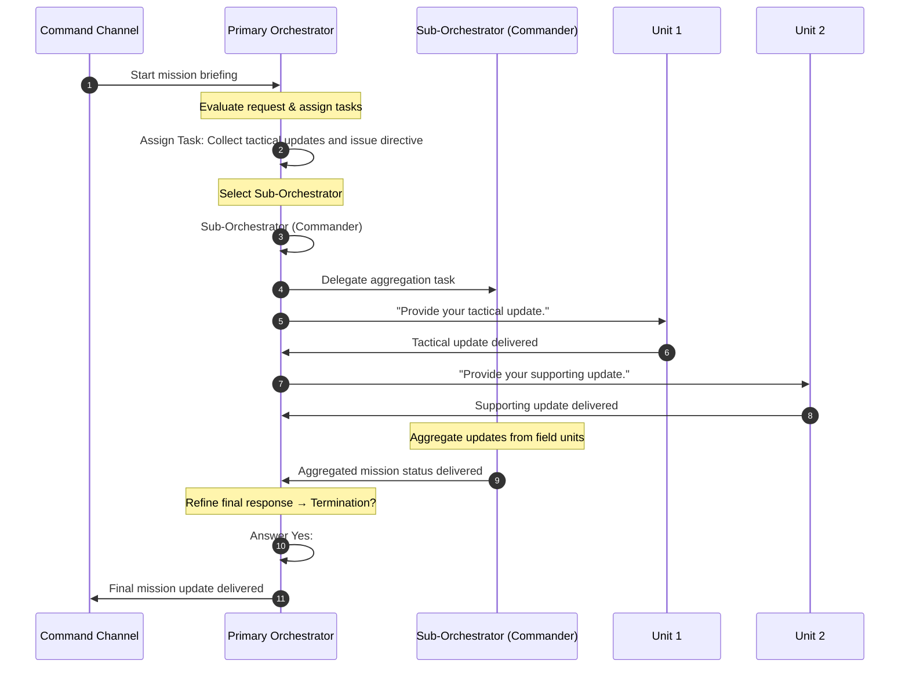
```mermaid
sequenceDiagram
    autonumber
    participant ChatEnv as Command Channel
    participant PO as Primary Orchestrator
    participant SO as Sub-Orchestrator (Commander)
    participant U1 as Unit 1
    participant U2 as Unit 2
    ChatEnv->>PO: Start mission briefing
    Note over PO: Evaluate request & assign tasks
    PO->>PO: Assign Task: Collect tactical updates and issue directive
    Note over PO: Select Sub-Orchestrator
    PO->>PO: Sub-Orchestrator (Commander)
    PO->>SO: Delegate aggregation task
    PO->>U1: "Provide your tactical update."
    U1->>PO: Tactical update delivered
    PO->>U2: "Provide your supporting update."
    U2->>PO: Supporting update delivered
    Note over SO: Aggregate updates from field units
    SO->>PO: Aggregated mission status delivered
    Note over PO: Refine final response → Termination?
    PO->>PO: Answer Yes:
    PO->>ChatEnv: Final mission update delivered
```

---

<h2 id="conclusion">7. Conclusion</h2>

This white paper has presented the roles of Agents and Orchestrators in multi-agent systems, along with various orchestration patterns and detailed sample scenarios. Each section includes a detailed description, relevant links for further reading, the explicit pattern used, and the original sequence diagrams illustrating the process flows.

These techniques offer valuable strategies for building systems that are efficient, flexible, scalable, and robust. Enjoy exploring these orchestration techniques and applying them to advanced multi-agent systems using the Semantic Kernel framework and beyond!
 