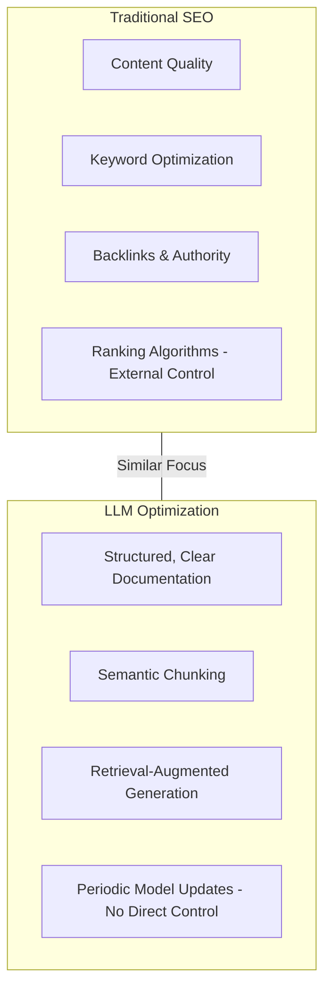
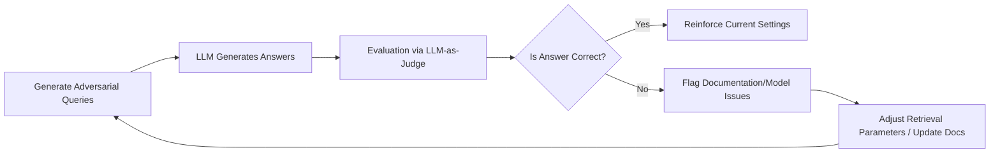
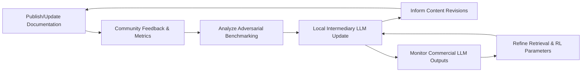

 
# Navigating LLMs When You Don’t Control the Algorithm
Author: Michael Weilbacher (MW)

**Businesses today face a challenge with Large Language Model (LLM) platforms similar to the early days of search engines:** they rely on external algorithms that they neither own nor directly control. Just as companies had to adapt their content for Google’s search algorithm, they now must adapt to **commercial LLMs** (like ChatGPT, Bing Chat, Google’s Bard/Gemini, etc.) that generate answers from vast data. Below we explore the parallels with SEO, strategies for ensuring your content is accurately represented in AI outputs, and best practices to remain competitive despite constant AI model updates.

## SEO vs. LLM Optimization (LLMO): Parallels in Lack of Control

**Like SEO, optimizing for LLMs means influencing an algorithm you don’t own.** In traditional SEO, businesses could not dictate how Google ranked pages – they optimized content in hopes of better visibility. Similarly, with **LLM Optimization (LLMO)**, you cannot directly control an AI’s training or output, only *influence* it through your content. The core dynamic remains the same: you’re trying to get an external system to favor or feature your information without direct access to its ranking logic ([LLM optimization: Can you influence generative AI outputs?](https://searchengineland.com/large-language-model-optimization-generative-ai-outputs-433148#:~:text=%3E%20%20%20,for%20classical%20information%20retrieval%20systems%E2%80%A6)). Some key parallels include:

- **No Direct Ranking Control:** Neither SEO nor LLMO lets you **manually set your rank**. Google’s algorithm determined search rankings; now LLMs decide which sources or facts to include in answers. You must earn visibility organically (through relevance and quality) rather than by dictate.  
- **Focus on Content Relevance and Quality:** Both SEO and LLMO reward content that the algorithm deems relevant and trustworthy. In SEO this meant high-quality, keyword-optimized pages; for LLMs it means content that is accurate, well-structured, and frequently mentioned in authoritative sources so the model “learns” or retrieves it.  
- **Algorithm Updates Require Adaptation:** Just as Google’s updates (Panda, Penguin, etc.) forced SEO strategy changes, LLM model updates can alter how or if your information appears. Businesses must be agile and ready to adjust content strategy when a new model version or AI search feature rolls out.  
- **Emergence of Optimization Tactics:** In SEO, practices like keyword research, link-building, and schema markup arose. For LLMs, we’re seeing early analogues – e.g. *Generative Engine Optimization (GEO)* or *LLM optimization* strategies ([LLM optimization: Can you influence generative AI outputs?](https://searchengineland.com/large-language-model-optimization-generative-ai-outputs-433148#:~:text=,that%20summarizes%20results%20for%20users)) focusing on **content structuring, prompt-relevant phrasing, and being cited by trusted sources** so that AI outputs mention your brand.

To illustrate these parallels, consider the following comparison diagram:

*For further reading on SEO fundamentals, visit [Google’s SEO Starter Guide](https://developers.google.com/search/docs/fundamentals/seo-starter-guide).*

Notably, some experts observe that this is *“not a completely new approach but a shift in perspective”* – effectively, LLMs are a new interface for information retrieval, so the optimization focus shifts accordingly ([LLM optimization: Can you influence generative AI outputs?](https://searchengineland.com/large-language-model-optimization-generative-ai-outputs-433148#:~:text=,that%20summarizes%20results%20for%20users)). In practice, this means businesses should prepare for LLMs much as they did for search engines: by creating the kind of content that the system prefers to surface, even if the mechanics under the hood differ.

## Ensuring Your Content is Represented (Without Owning the Algorithm)

**How can businesses make sure their documentation and content show up correctly in LLM-generated answers?** The key is to work *with* the limitations of not owning the algorithm:

- **Prioritize Clarity and Accuracy:** Write documentation that is **unambiguous, factual, and up-to-date**. LLMs generate answers based on patterns in their training data – if your docs are confusing or buried in irrelevant text, the model might misinterpret them. Ensure important facts (product names, features, official statements) are stated clearly and consistently across your content. This makes it more likely the AI will capture the correct information.  
- **Establish Authority and Trust:** Just as Google favors authoritative sites, LLMs trained on web data likely give more weight to trusted sources ([LLM optimization: Can you influence generative AI outputs?](https://searchengineland.com/large-language-model-optimization-generative-ai-outputs-433148#:~:text=There%20are%20two%20possible%20approaches,T%20and%20ranking)). You can’t control the training, but you can **bolster your content’s authority**. For example, have experts author your documentation, get your site verified or linked by reputable organizations, and maintain a positive reputation. Many LLM providers may use quality filters (similar to Google’s E-E-A-T: Experience, Expertise, Authoritativeness, Trustworthiness) to decide which data to trust ([LLM optimization: Can you influence generative AI outputs?](https://searchengineland.com/large-language-model-optimization-generative-ai-outputs-433148#:~:text=There%20are%20two%20possible%20approaches,T%20and%20ranking)). If your documentation is known to be authoritative (or part of a known knowledge base), it stands a better chance of being used correctly by the AI.  
- **Distribute Information Widely:** Because you can’t directly feed an update into someone else’s LLM training pipeline on demand, it helps to **publish important information across multiple channels** the AI is likely to ingest. For instance, if you have a major product update or clarification, consider adding it to your official docs *and* posting a blog, a press release, or a community forum Q&A. LLMs train on diverse web content; if your update is echoed on news sites, Wikipedia, industry blogs, etc., it increases the chance the model will pick it up next time it’s refreshed. (In fact, being *“mentioned in qualified media”* and becoming part of the broader knowledge graph is one strategy experts suggest for influencing LLM outputs ([LLM optimization: Can you influence generative AI outputs?](https://searchengineland.com/large-language-model-optimization-generative-ai-outputs-433148#:~:text=,part%20of%20the%20knowledge%20graph)).)  
- **Content Structure for AI Readability:** Write and format your content in a way that’s easy for an AI to parse. This includes using descriptive headings, bullet points (for lists or step-by-steps), tables for structured info, and concise summaries. AI models often favor content that is well-structured and straightforward when extracting facts ([GEO vs. SEO: How to Optimise for AI Search Engines | Pure SEO](https://pureseo.com/blog/geo-vs-seo-ai-search-engines#:~:text=match%20at%20L313%20is%20easier,concise%20writing%20essential%20for%20visibility)) ([GEO vs. SEO: How to Optimise for AI Search Engines | Pure SEO](https://pureseo.com/blog/geo-vs-seo-ai-search-engines#:~:text=Just%20like%20traditional%20search%20engines%2C,process%20and%20reference%20their%20content)). For example, include a **FAQ section** or a clearly labeled “Key Takeaways” in your documentation – an LLM might latch onto these concise statements when formulating answers.  
- **Monitor AI Outputs and Identify Gaps:** Since you can’t *ensure* correct representation 100% of the time, it’s important to **audit** what LLMs are saying about your business. Regularly ask commercial chatbots questions about your products or guides (“What does Company X’s tool do?”, “How do I fix issue Y in Product Z?”) and see if the answers align with your documentation. If you find inaccuracies or missing info, treat it as feedback to improve your content. Often, tweaking your documentation (e.g. adding a clarifying note or an explicit mention of a key fact) can help future AI models get it right. Think of this as an ongoing dialogue: you publish content, observe the AI’s interpretation, and then refine your content.

Crucially, **accept that you won’t have 1:1 control** over LLM outputs. Instead of trying to force outcomes, focus on making your content the kind that *naturally* rises to the top of the AI’s knowledge – clear, correct, and contextual. Over time, this increases the likelihood that an AI will represent your information as intended, even if the “black box” algorithm is outside your control.

## Structured Data: Speaking the AI’s Language

One powerful way to improve how LLMs understand and use your content is through **structured data**. This includes adding Schema.org markup (JSON-LD/RDFa) to your pages, providing metadata, or offering information via knowledge graph entries. **Structured data acts as a cheat-sheet for AI,** giving machine-readable context about your content’s meaning.

- **Entities and Facts in Training Data:** Modern generative AI search engines are trained on vast datasets that *include* structured data markup ([Structured Data In 2024: Key Patterns Reveal The Future Of AI Discovery](https://www.searchenginejournal.com/structured-data-in-2024/532846/#:~:text=Generative%20AI%20search%20engines%20are,data%20markup%2C%20influencing%20how%20they)). This means the schema annotations on your site (for products, FAQs, how-tos, etc.) could directly influence how the model learns about those entities. For example, structured data helps AI *“recognize and categorize entities”* (like identifying your product name as a product, your CEO as a person, your location as a place) and *“ground responses in verifiable facts”* ([Structured Data In 2024: Key Patterns Reveal The Future Of AI Discovery](https://www.searchenginejournal.com/structured-data-in-2024/532846/#:~:text=Generative%20AI%20search%20engines%20are,data%20markup%2C%20influencing%20how%20they)). In practice, if your documentation uses schema to highlight product attributes or definitions, an LLM might more reliably recall those details when answering a question.  
- **Knowledge Graph Alignment:** Search engines use structured data to build their knowledge graphs, which LLMs may reference for factual consistency ([Structured Data In 2024: Key Patterns Reveal The Future Of AI Discovery](https://www.searchenginejournal.com/structured-data-in-2024/532846/#:~:text=structured%20data%20markup%2C%20influencing%20how,they)). Ensuring your business has a robust knowledge graph presence (e.g. through Wikipedia, Wikidata entries, Google’s Knowledge Panel info, etc.) can make your information more resilient. If an LLM cross-references a knowledge graph to fact-check, you want your facts to be present and correct there. *Becoming part of the knowledge graph* has been cited as a goal for influencing LLM outputs ([LLM optimization: Can you influence generative AI outputs?](https://searchengineland.com/large-language-model-optimization-generative-ai-outputs-433148#:~:text=,part%20of%20the%20knowledge%20graph)). Tactically, this could mean providing schema markup for organization details, publishing datasets or structured FAQs, and using consistent identifiers (like sameAs links to your Wikipedia or social profiles) so that various AI systems can unambiguously tie content back to your brand or products.  
- **Schema for Better Retrieval:** Even if structured data doesn’t directly boost *training* inclusion, it can improve how AI *search* systems retrieve your content. Some AI search tools and chatbots use search engines under the hood to find relevant info (this is part of a **hybrid AI** approach). Structured data (like FAQ schema or product schema) can enhance your appearance in search results and make it clear to AI what your page contains. For instance, if a user asks an AI assistant a question that maps to a FAQ on your site marked up with schema, the AI is more likely to find and present that specific answer. Essentially, **schema markup increases machine comprehension**, which is valuable both for traditional search ranking and for AI systems that “read” the web to formulate answers ([GEO vs. SEO: How to Optimise for AI Search Engines | Pure SEO](https://pureseo.com/blog/geo-vs-seo-ai-search-engines#:~:text=match%20at%20L711%20Just%20like,process%20and%20reference%20their%20content)).

*Bottom line:* Incorporate structured data wherever relevant – it’s an investment in future-proofing your content. As one 2024 study noted, the role of structured data has expanded from traditional SEO to *“forming the foundation for factual AI responses”* ([Structured Data In 2024: Key Patterns Reveal The Future Of AI Discovery](https://www.searchenginejournal.com/structured-data-in-2024/532846/#:~:text=This%20rapid%20evolution%20signals%20a,and%20enhanced%20digital%20product%20experiences)). By annotating your documentation with schema (and keeping that data updated), you help LLMs interpret your content correctly and reduce the chance of it being misrepresented when the models evolve.

## Retrieval-Augmented Generation (RAG): Leverage it to Your Advantage

**RAG – Retrieval-Augmented Generation –** is emerging as a key technique to keep AI outputs accurate and current. In a RAG setup, the LLM isn’t answering questions purely from its static trained knowledge; instead, it actively *retrieves documents or data* (often via a search index or database) and uses that as context to generate its answer ([How to Optimize for LLMs and Get Cited in AI Outputs](https://www.advancedwebranking.com/blog/llm-optimization-generative-ai-outputs#:~:text=Retrieval,or%20unstructured%20data)). This has huge implications for businesses trying to ensure their latest documentation is reflected.

**How can businesses make documentation “RAG-friendly”?**

- **Optimize for Indexing and Retrieval:** If an AI assistant (like Bing Chat or Google’s SGE) uses web retrieval, then traditional SEO factors regain importance – your content needs to be easily found and ranked in the top results for relevant queries. In fact, studies of Google’s AI-generated Search Overviews found that *the sources cited by the AI weren’t always the top organic results*, indicating a slightly different algorithm at play, but they still had to be *in* the search index in the first place ([How to Optimize for LLMs and Get Cited in AI Outputs](https://www.advancedwebranking.com/blog/llm-optimization-generative-ai-outputs#:~:text=One%20thing%20all%20SGE%2C%20now,iPullRank%2C%20PeakAce%2C%20SERanking%2C%20and%20Brightedge)). Focus on **technical SEO basics**: ensure your documentation is crawlable (no blockers like logins or onerous scripts), loads fast, and is rich in the keywords and questions users might ask ([How to Optimize for LLMs and Get Cited in AI Outputs](https://www.advancedwebranking.com/blog/llm-optimization-generative-ai-outputs#:~:text=,below%20500ms)). The faster and cleaner your page, the more likely an AI will include it – Google’s AI summaries, for example, have been observed to *prefer “lightweight” websites* that deliver content quickly ([How to Optimize for LLMs and Get Cited in AI Outputs](https://www.advancedwebranking.com/blog/llm-optimization-generative-ai-outputs#:~:text=Overviews,iPullRank%2C%20PeakAce%2C%20SERanking%2C%20and%20Brightedge)).  
- **Provide Fresh Content for Retrieval:** One advantage of RAG is that it can use up-to-date information. Make sure you **publish updates promptly and regularly** so that when AIs fetch data, they get the latest. If you have a product documentation site, keep an updated changelog or “What’s new” page; if you have a knowledge base, add new Q&As for common new issues. A RAG-driven system will pull whatever is out there – being the first to publish authoritative info on a new development can make your content the source that AI responses draw from ([How to Optimize for LLMs and Get Cited in AI Outputs](https://www.advancedwebranking.com/blog/llm-optimization-generative-ai-outputs#:~:text=Another%20obvious%20kind%20of%20content,get%20cited%20as%20a%20source)). (Conversely, if you lag and someone else’s content becomes the go-to source on your product, the AI might learn/cite them instead.)  
- **Consider Your Own RAG Implementations:** Many organizations deploy their **own LLM-based assistants** (e.g. a customer service chatbot that answers from the company’s documentation). Using RAG in these systems allows you to control and update the reference data at will. For instance, you might integrate a vector database of your manuals and feed that to an LLM, so it always bases answers on the latest docs. RAG is valuable here because it *“ensures responses are not only accurate but also up-to-date”* by injecting your current data into the answer generation ([RAG Tutorial: A Beginner's Guide to Retrieval Augmented Generation](https://www.singlestore.com/blog/a-guide-to-retrieval-augmented-generation-rag/#:~:text=Generation%20www,date%20and)). This way, even if the base model is outdated, your customers get current answers. If your business has the resources, offering an official GPT plugin or API that uses RAG with your data can also influence how third-party LLMs provide answers about you (for example, a ChatGPT plugin that queries your knowledge base guarantees the AI uses your content).  
- **RAG Reduces Hallucinations:** From a content resilience perspective, RAG helps mitigate the risk of an AI **hallucinating** information about your product. Instead of relying purely on what it “thinks” it knows (which might be outdated or conflated with another source), the LLM with RAG will pull the answer from your documentation if available. This *“greatly reduces the number of wrong answers”* and can steer the model toward **using your reliable sources** ([How to Optimize for LLMs and Get Cited in AI Outputs](https://www.advancedwebranking.com/blog/llm-optimization-generative-ai-outputs#:~:text=Retrieval,or%20unstructured%20data)) ([How to Optimize for LLMs and Get Cited in AI Outputs](https://www.advancedwebranking.com/blog/llm-optimization-generative-ai-outputs#:~:text=RAG%20can%20also%20be%20used,terms%20like%20golf%20or%20bark)). In practice, that means fewer instances of the AI making up features or misattributing capabilities – a big win for maintaining your content’s integrity. 

In summary, treat RAG as both an opportunity and a discipline: an opportunity to inject your authoritative content into AI responses, and a discipline of keeping that content **search-friendly and up-to-date**. As long as external LLMs use some form of retrieval, there’s a door open for you to provide the “ground truth” — you just need to ensure your data is the one being fetched when the AI comes knocking.

 ([Retrieval Augmented Generation (RAG) | Pinecone](https://www.pinecone.io/learn/retrieval-augmented-generation/)) *Schematic of **Retrieval-Augmented Generation (RAG)** in action. A user’s query is converted to an embedding and used to fetch relevant company data (e.g. documentation) from a vector database. That context is fed into the LLM (gen AI model) to produce a **reliable, up-to-date answer** using your content. RAG allows AI outputs to stay current and factual by grounding responses in external sources ([Retrieval Augmented Generation (RAG) | Pinecone](https://www.pinecone.io/learn/retrieval-augmented-generation/#:~:text=Retrieval%20Augmented%20Generation%20means%20fetching,accuracy%20of%20your%20GenAI%20application)) ([Retrieval Augmented Generation (RAG) | Pinecone](https://www.pinecone.io/learn/retrieval-augmented-generation/#:~:text=RAG%20addresses%20this%20second%20issue,to%20generate%20an%20informed%20answer)).* 

## Adversarial Benchmarking: Test Your Content Against the AI

Given that LLM algorithms are outside your control and ever-changing, it’s wise to regularly **“stress-test” your content against AI models** – an approach we can call *adversarial benchmarking*. This doesn’t mean attacking the AI, but rather simulating worst-case or tricky scenarios to see how your documentation holds up, then improving it.

**What does adversarial benchmarking involve?**

- **Probing for Weaknesses:** Periodically ask LLMs a battery of questions about your products or documentation, including edge cases and intentionally misleading phrasing. For example, if your software has a version 1 and version 2, ask the AI about features of each – does it mix them up? If your product name is similar to another term, does the AI get confused? Treat this like QA testing, but for AI understanding. When you find inaccuracies, note what might have caused them – was your content unclear or did the AI pull from an unofficial source? This process helps identify parts of your documentation that might be misinterpreted after a model update.  
- **Benchmark Across Models:** Don’t just test one AI. Try the popular ones – ChatGPT, Bing Chat, Google’s AI, and any domain-specific models if relevant. Each may have been trained on different data snapshots or use different retrieval methods. If most models correctly answer a question using your content but one doesn’t, that model might not have accessed your latest info (or has a bias). This could alert you to, say, update content in places that particular AI is looking (for instance, if Bard isn’t catching your info, maybe Google didn’t index your update – check your SEO). By benchmarking across models, you **reduce the chance of being blindsided** by a single AI’s quirks.  
- **Adversarial Content Testing:** Consider what a competitor or malicious actor might do. There’s research indicating that **carefully crafted content can manipulate LLM outputs** – e.g. a fake “documentation” page filled with certain phrases might trick an AI into favoring one product over another ([Adversarial Search Engine Optimization for Large Language Models | OpenReview](https://openreview.net/forum?id=hkdqxN3c7t#:~:text=where%20the%20model%20selects%20from,parties%20are%20incentivized%20to%20launch)). While your aim isn’t to deceive, you should be aware of how your content could be outcompeted by such tactics. If less scrupulous players flood the web with misleading info about your niche, will the AI pick them up over you? Adversarial benchmarking could involve creating a throwaway test page that mimics a misinformation attempt and seeing if the AI falls for it. This helps you understand the AI’s vulnerabilities and shore up your own content (perhaps by publishing clarifications or getting official facts more prominence).  
- **Resilience to Model Updates:** When a major LLM update or new model (say GPT-5) is released, re-run your benchmarks. Treat it like a Google core update in SEO – check what changed. Maybe the AI now cites fewer sources, or it has improved factual accuracy (good if you had correct data, bad if it had wrong info about you that is now “stickier”). By continuously testing, you can catch shifts early and adapt. For instance, if an AI update drops references to your site, you might need to reemphasize certain keywords or publish new content to regain that AI’s “attention.”

### The Adversarial Benchmarking Process:
1. **Generate Adversarial Queries:** Craft challenging or edge-case queries based on your content.
2. **Evaluate Responses:** Use an LLM-as-a-judge mechanism to assess whether the responses match your intended meaning.
3. **Feedback Loop:** Adjust your documentation or retrieval parameters based on evaluation results.

This process is depicted in the following diagram:

*For further reading on adversarial testing in AI, check out [this research summary](https://arxiv.org/abs/2106.04535).*

One caution: **avoid unethical manipulation.** While it might be tempting to game the AI (the way black-hat SEOs tried to game Google), this is risky. Researchers warn that if everyone tries to trick LLMs with adversarial content, *“all parties are incentivized to launch attacks, but this collectively degrades the LLM’s outputs for everyone.”* ([Adversarial Search Engine Optimization for Large Language Models | OpenReview](https://openreview.net/forum?id=hkdqxN3c7t#:~:text=_Preference%20Manipulation%20Attacks_%2C%20a%20new,are%20increasingly%20used%20to%20rank)) In other words, a race to the bottom helps no one, and platforms will likely counteract such tricks in time (just as Google cracked down on link farms and keyword stuffing). Instead, use adversarial *testing* to make your content more robust, but stick to honest, user-helpful optimizations in practice.

## Adapting Content Strategy When You Can’t Control Training Cycles

In the SEO world, businesses eventually learned that the best long-term strategy was to align with the search engine’s ultimate goal – delivering value to users – rather than trying to directly manipulate rankings. The same principle applies for LLMs. **You cannot force an AI to learn or update on your schedule**. Training cycles might be infrequent and entirely out of your hands (e.g., an LLM might not incorporate new web data for months). So how do you adapt your content strategy for this reality?

**1. Embrace Quality and Relevance Over Quick Hacks:** In the past, Google’s algorithm updates punished thin content and rewarded expertise. Similarly, AI models will *implicitly* favor content that is comprehensive, correct, and relevant. High-quality content has a better chance of being cited or used by LLMs, either in training or via retrieval. This means investing in well-written documentation, thorough FAQs, how-to guides, and thought leadership pieces that **cover topics in depth**. If your content is considered a definitive resource in your domain, future AI models are more likely to “know” about it. As one expert put it, the goal is to *“establish your own media via E-E-A-T as a source of training data”* and create associations of your brand with key topics ([LLM optimization: Can you influence generative AI outputs?](https://searchengineland.com/large-language-model-optimization-generative-ai-outputs-433148#:~:text=,part%20of%20the%20knowledge%20graph)). In practice, that might involve publishing authoritative articles (and getting them linked), encouraging user reviews or discussions (to increase mentions of your product in context), and maintaining transparency and accuracy so that your brand is seen as trustworthy. These are long-term plays – much like content marketing for SEO – but they pay dividends by making your information sturdier against algorithmic shifts.

**2. Leverage Structured and **AI-Friendly** Formats:** We discussed structured data, but also look at the format of your content itself. Break documentation into logical sections, use semantic HTML (meaningful tags for titles, lists, code snippets, etc.), and perhaps offer multiple formats (HTML, PDF, even video transcripts) if possible. Different AI systems may prefer different formats (some might have ingested your PDF manual, others scraped your HTML site). Cover your bases by offering content in a variety of machine-digestible ways. Also, **maintain an updated sitemap or feed** – if an AI or search engine periodically checks your site, a fresh sitemap.xml or RSS feed can alert it to new content. While you can’t dictate when OpenAI or Google’s crawler comes, you can make sure whenever they do, they find a well-organized repository of knowledge. As a best practice, ensure *all* important info is in text on your pages (not locked in images or videos without transcripts), so nothing is missed by an AI that doesn’t process images. 

**3. Stay Agile with Content Updates (but Strategic):** Since you don’t control training cycles, it’s smart to schedule **regular content reviews** on your end. Every time you hear of a major LLM update or a new AI product (say a new AI search feature), consider auditing your content for alignment. For instance, if Google announces a quarterly refresh of its AI model, maybe plan your content releases just before that if feasible, so the new info stands a chance of inclusion. This is somewhat speculative – unlike SEO, we often don’t know when an LLM will be retrained – but keeping content fresh is universally beneficial. At the same time, don’t chase every minor tweak. Prioritize *evergreen, resilient content.* If you’ve adapted once to clearly cover a concept, you shouldn’t need to rewrite it for every AI update. Instead, **layer on new content for new developments** and fix only clear issues the benchmarking revealed. Over-editing content purely to please an algorithm can lead to diminishing returns (and was a lesson learned in SEO as well).

**4. Utilize Community and Feedback:** Just as businesses adapted to SEO by using analytics and user feedback (e.g., looking at search query data to see what content users wanted), you should gather feedback on how AI is presenting your brand. This could be anecdotal (sales or support teams sharing what customers “heard from ChatGPT”) or more systematic (conducting surveys or social listening for your brand mentions in AI context). Use this feedback to guide content tweaks. If people frequently get a wrong answer from an AI about your product, prioritize setting the record straight on that issue through content. Additionally, engage with the AI providers’ feedback mechanisms if available – for example, if Bing’s answer about your company is wrong, use the feedback option to correct it. It might not fix it immediately, but if such feedback is collected at scale, it could influence future model behavior or prompt the AI providers to fetch updated info.

**5. Borrow from Past SEO Adaptations:** Remember how businesses dealt with not controlling Google: they **focused on fundamentals** (site quality, relevant content, genuine marketing) and diversified traffic sources. Apply the same wisdom here. Don’t rely solely on LLM-driven traffic or visibility. Continue to maintain your SEO for traditional search (many users still use classic search results), build direct relationships with your audience (newsletters, forums, social media), and perhaps even create your *own* AI tools (if appropriate) to lessen sole dependence on third-party AI. In the SEO world, those who chased every algorithm loophole often lost in the long run, whereas those who built strong brands and useful content weathered the changes. For LLMs, the analogous approach is to **make your documentation so user-helpful and authoritative that any intelligent system would “want” to use it**. That might sound abstract, but it boils down to the quality, accessibility, and credibility points discussed throughout.

### The Continuous Cycle Includes:
- **Publishing and Updating Documentation:** Regularly revise your content based on new developments and user feedback.
- **Community Feedback and Metrics:** Use direct feedback from users (via forums, surveys, or analytics) to identify gaps.
- **Local Model Updates:** Maintain an in-house model to test and validate content before it reaches the wider ecosystem.
- **Feedback into Content Revisions:** Use insights from benchmarking and local testing to refine documentation.
- **Monitoring Commercial LLM Outputs:** Ensure that your optimizations are reflected externally.

The cycle is illustrated in the following diagram:

*For more details on continuous learning and retraining, see [this overview of continual learning methods](https://ruder.io/continual-learning/).*

## Staying Competitive in the AI Search Era

Even without direct control over LLM algorithms or training cycles, companies can absolutely remain competitive. The key is to be proactive and **strategic in how you present and disseminate information**:

- **Invest in AI-Optimized Content:** This means content that is *machine-friendly* (structured, well-formatted) and *user-friendly* (clear, authoritative). Such content is more likely to be picked up correctly by AI models. Think of it as speaking the AI’s language while still satisfying the human reader – the two goals actually align in emphasizing clarity and truth.  
- **Build a Resilient Information Ecosystem:** Don’t keep your knowledge in one silo. Use your website, developer portals, Q&A sites, documentation hubs, and third-party platforms so that your information is everywhere a model might look. By having a presence in **“database-style websites”** (like industry directories, review sites) and **community-moderated sites** (Wikipedia, StackExchange, etc.), you create multiple touchpoints for AI to learn about you ([How to Optimize for LLMs and Get Cited in AI Outputs](https://www.advancedwebranking.com/blog/llm-optimization-generative-ai-outputs#:~:text=Coming%20back%20to%20general%20RAG,date%20and%20favorable%20entries)) ([How to Optimize for LLMs and Get Cited in AI Outputs](https://www.advancedwebranking.com/blog/llm-optimization-generative-ai-outputs#:~:text=%2A%20Have%20an%20up,like%20Yelp%2C%20Crunchbase%2C%20and%20IMDB)). This redundancy makes your info more update-proof – if one source falls out of an AI’s training data, another might still inform it.  
- **Monitor, Measure, and Adapt:** Treat AI visibility as a new metric alongside SEO rankings. For example, track how often AI assistants mention your brand or link to your content (some SEO tools and emerging platforms can help with this tracking) ([GEO vs. SEO: How to Optimise for AI Search Engines | Pure SEO](https://pureseo.com/blog/geo-vs-seo-ai-search-engines#:~:text=,value%20queries)). Pay attention to accuracy – it’s not just about being mentioned, but being *correctly* represented. Set up a process internally to review AI outputs about your company on a regular cadence. Make adjustments to content strategy based on these insights, much like how you’d refine SEO keywords or improve pages with high bounce rates.  
- **Ethical Optimization:** Finally, commit to ethical practices. Ensuring your information is interpreted as intended is about **clarity and correctness**, not trickery. If you focus on the former, you build a durable competitive advantage – users will trust your brand and eventually the AI will align with that trust (since it favors credible sources). If you attempt the latter (gaming the AI), you might win in the short term but risk penalties or reputation damage in the long term. Remember that AI models and search engines ultimately share a goal: deliver useful answers to users. Align your content strategy to that goal, and you’ll naturally ride the wave of algorithm changes instead of being drowned by them.

In conclusion, businesses should approach LLMs much like they did search engines: with a mix of **technical know-how, content excellence, and adaptability**. You may not control the algorithm, but you *do* control the quality of the information you put into the world. By making that information structured, accessible, and authoritative, you greatly increase the odds that even an ever-evolving AI will interpret and present it in line with your intentions. It’s an ongoing effort – SEO was not “set and forget,” nor will LLM optimization be – but companies that stay vigilant and user-focused will find that they can thrive in this new era of AI-driven information discovery.

**Sources:**

1. Olaf Kopp, *“LLM optimization: Can you influence generative AI outputs?”*, Search Engine Land – discusses the emerging practice of optimizing for AI-driven search and parallels to SEO ([LLM optimization: Can you influence generative AI outputs?](https://searchengineland.com/large-language-model-optimization-generative-ai-outputs-433148#:~:text=,that%20summarizes%20results%20for%20users)) ([LLM optimization: Can you influence generative AI outputs?](https://searchengineland.com/large-language-model-optimization-generative-ai-outputs-433148#:~:text=,part%20of%20the%20knowledge%20graph)).  
2. **Search Engine Journal**, *“Structured Data in 2024: Key Patterns Reveal The Future Of AI Discovery”* – highlights how schema markup and knowledge graphs are foundational for factual AI responses ([Structured Data In 2024: Key Patterns Reveal The Future Of AI Discovery](https://www.searchenginejournal.com/structured-data-in-2024/532846/#:~:text=This%20rapid%20evolution%20signals%20a,and%20enhanced%20digital%20product%20experiences)) ([Structured Data In 2024: Key Patterns Reveal The Future Of AI Discovery](https://www.searchenginejournal.com/structured-data-in-2024/532846/#:~:text=Generative%20AI%20search%20engines%20are,data%20markup%2C%20influencing%20how%20they)).  
3. Malte Landwehr, *“How to Optimize for LLMs and Get Cited in AI Outputs”*, Advanced Web Ranking Blog – provides practical tips for making content visible to LLMs, including the role of RAG and being included in AI search results ([How to Optimize for LLMs and Get Cited in AI Outputs](https://www.advancedwebranking.com/blog/llm-optimization-generative-ai-outputs#:~:text=Retrieval,or%20unstructured%20data)) ([How to Optimize for LLMs and Get Cited in AI Outputs](https://www.advancedwebranking.com/blog/llm-optimization-generative-ai-outputs#:~:text=,below%20500ms)).  
4. *Pure SEO Blog*, *“GEO vs. SEO: How to Optimise for AI Search Engines”* – outlines best practices for Generative Engine Optimization, emphasizing structured, AI-friendly content and monitoring AI citations ([GEO vs. SEO: How to Optimise for AI Search Engines | Pure SEO](https://pureseo.com/blog/geo-vs-seo-ai-search-engines#:~:text=match%20at%20L711%20Just%20like,process%20and%20reference%20their%20content)) ([GEO vs. SEO: How to Optimise for AI Search Engines | Pure SEO](https://pureseo.com/blog/geo-vs-seo-ai-search-engines#:~:text=,time%20web)).  
5. Nestaas et al., *“Adversarial Search Engine Optimization for Large Language Models”* (ICLR 2025 paper) – warns that manipulative content can bias LLM outputs, akin to black-hat SEO, degrading quality for everyone ([Adversarial Search Engine Optimization for Large Language Models | OpenReview](https://openreview.net/forum?id=hkdqxN3c7t#:~:text=where%20the%20model%20selects%20from,parties%20are%20incentivized%20to%20launch)) ([Adversarial Search Engine Optimization for Large Language Models | OpenReview](https://openreview.net/forum?id=hkdqxN3c7t#:~:text=_Preference%20Manipulation%20Attacks_%2C%20a%20new,are%20increasingly%20used%20to%20rank)).